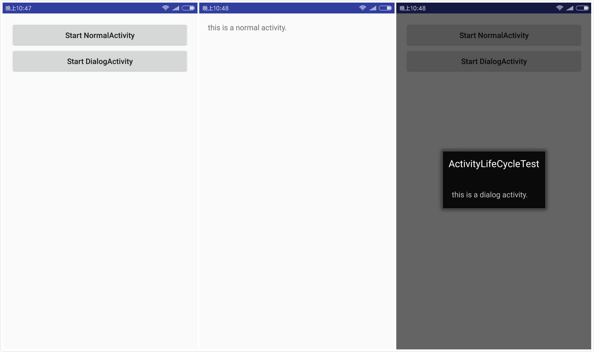
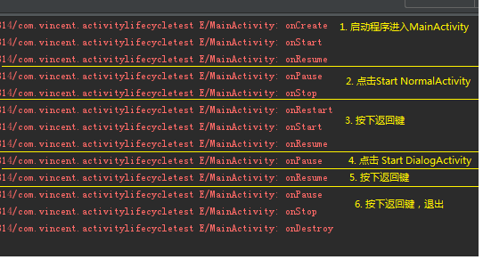

本文目的在于详细总结 Activity 的生命周期。

### 返回栈
Android 的 Activity 是可以层叠的，以返回栈（Back Stack）存放 Activity。默认情况下，当我们启动一个活动，它会在返回栈中入栈，处于栈顶的位置。当我们按下返回键或者调用 `finish()` 方法销毁一个活动，处于栈顶的活动会出栈，前一个入栈的活动会重新处于栈顶，用户看到的永远是栈顶的活动。
### Activity 四种状态
**运行**：活动位于返回栈的栈顶，对用户可见。

**停止**：该活动被另一活动完全遮盖，它对用户不可见，不再处于栈顶。在系统需要内存时可能会被终止。

**暂停**：当一个活动不再处于栈顶，但此活动仍然可见。也就是说，另一个活动显示在此活动的上方，此活动部分透明或未覆盖整个屏幕。系统仍然会为这种活动保存相应的状态和成员变量，但并不可靠，在内存极低时，仍有可能被系统回收。

**销毁**：当一个活动从返回栈中被移除。系统最愿意回收这种状态的活动。

### Activity 生存期
Activity 类定义了 7 个回调方法。

- **onCreate()**：首次创建活动时调用，初始化工作，加载布局、绑定事件。后接 `onStart()`。
- **onStart()**：在活动即将对用户可见之前调用。后接 `onResume()`。
- **onResume()**：在活动即将开始与用户进行交互之前调用，此时活动位于栈顶。后接 `onPause()`。
- **onPause()**：当系统即将开始启动或恢复另一个活动时调用。如果活动返回前台，则后接 `onResume()`，如果活动转入对用户不可见状态，则后接 `onStop()`。
- **onStop()**：当活动对用户不再可见时调用。如果活动恢复与用户的交互，则后接 `onRestart()`，如果活动被销毁，则后接 `onDestroy()`。
- **onDestroy()**：在活动被销毁前调用。
- **onRestart()**：在活动已停止并即将再次启动前调用。后接 `onStart()`。

**整个生存期**： 发生在 `onCreate()` 和 `onDestroy()` 之间。一般情况，活动会在 `onCreate()` 中做初始化工作，在 `onDestroy()` 中释放内存。

**可见生存期**： 发生在 `onStart()` 和 `onStop()` 之间。活动对于用户始终可见，即便不能与用户交互。

**前台生存期**：发生在 `onResume()` 和 `onPause()` 之间。活动始终处于运行状态。

[Android 官网](https:Andr//developer.android.google.cn/guide/components/activities.html?hl=zh-cn)提供的 Activity 生命周期图如下图所示。


## Demo 实例 
1、新建工程 ActivityLifeCycleTest。
2、创建两个子活动 NormalActivity 和 DialogActivity，其中 NormalActivity 是普通的 Activity，DialogActivity 是对话框式的 Activity，在 AndroidManifest.xml 中将 DialogActivity 使用对话框的主题。

```xml
<activity android:name=".DialogActivity"
            android:theme="@android:style/Theme.Dialog"></activity>
```
3、在主活动的布局中添加两个按钮分别用于跳转到两个 Activity。在 MainActivity.java 中重写生命周期图中的七种方法。
```java
package com.vincent.activitylifecycletest;
import android.app.Activity;
import android.content.Intent;
import android.os.Bundle;
import android.util.Log;
import android.view.View;
import android.widget.Button;

public class MainActivity extends Activity {
    public static final String TAG = "MainActivity";

    @Override
    protected void onCreate(Bundle savedInstanceState) {
        super.onCreate(savedInstanceState);
        Log.e(TAG, "onCreate");
        setContentView(R.layout.activity_main);
        Button startNormalActivity = (Button) findViewById(R.id.start_normal_activity);
        Button startDialogActivity = (Button) findViewById(R.id.start_dialog_activity);

        startNormalActivity.setOnClickListener(new View.OnClickListener() {
            @Override
            public void onClick(View view) {
                Intent intent = new Intent(MainActivity.this, NormalActivity.class);
                startActivity(intent);
            }
        });

        startDialogActivity.setOnClickListener(new View.OnClickListener() {
            @Override
            public void onClick(View view) {
                Intent intent = new Intent(MainActivity.this, DialogActivity.class);
                startActivity(intent);
            }
        });

    }

   @Override
    protected void onStart() {
        super.onStart();
        Log.e(TAG, "onStart");
    }

    @Override
    protected void onResume() {
        super.onResume();
        Log.e(TAG, "onResume");
    }

    @Override
    protected void onPause() {
        super.onPause();
        Log.e(TAG, "onPause");
    }

    @Override
    protected void onStop() {
        super.onStop();
        Log.e(TAG, "onStop");
    }

    @Override
    protected void onDestroy() {
        super.onDestroy();
        Log.e(TAG, "onDestroy");
    }

    @Override
    protected void onRestart() {
        super.onRestart();
        Log.e(TAG, "onRestart");
    }
}

```
运行工程，主窗口如下左图所示，两个按钮分别用于启动 NormalActivity 和 DialogActivity。 



1. 启动程序首次进入 MainActivity，依次执行了 `onCreate() - onStart() - onResume()` 方法。
2. 点击 Start NormalActivity，跳转到 NormalActivity （上图中），依次执行了 `onPause() - onStop()` 方法。
3. 按下返回键，依次执行了 `onRestart() - onStart() - onResume()` 方法。
4. 点击 Start DialogActivity, 跳出 DialogActivity (上图右），执行了 `onPause()` 方法。
5. 按下返回键，执行了 `onResume()` 方法。
6. 再按下返回键，依次执行 `onPause() - onStop() - onDestroy()` 方法。



## 参考
- [Android官方文档](https://developer.android.google.cn/guide/components/activities.html?hl=zh-cn)
- [<第一行代码> 郭霖](https://www.amazon.cn/dp/B01MSR5D04)

