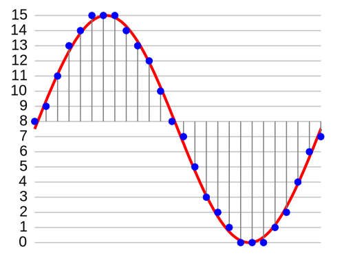
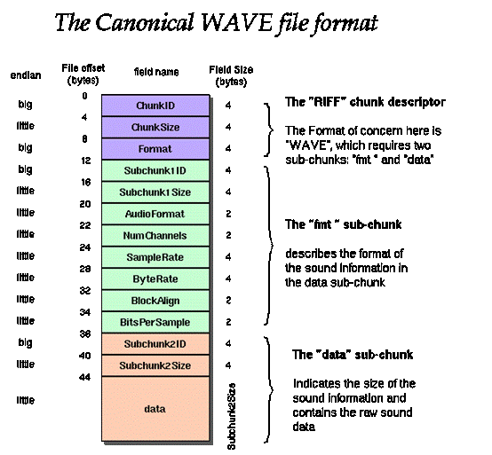

在具体使用 AudioRecord 采集音频之前，简单了解下 PCM。

## 什么是 PCM?

我们知道，声音本身是模拟信号，而计算机只能处理离散的数字信号，要在计算机中处理声音，就需要将声音数字化，这个过程叫模数转换（A/D 变换） 。模数转换直接生成的二进制序列称为 PCM（pulse code modulation， 脉冲编码调制）数据。它是数字音频在计算机、光盘、数字电话和其他数字音频应用中的标准形式。

要将模拟信号转为 PCM 时，需要将声音量化，我们一般从如下几个维度描述一段声音：

**采样频率**：每秒钟采集声音样本的次数，它用赫兹（Hz）来表示。

采样频率越高，声音的质量也就越好，声音的还原也就越真实，但同时它占的资源比较多。由于人耳的分辨率很有限，太高的频率并不能分辨出来。在 16 位声卡中有 22KHz、44KHz 等几级，,其中，22KHz 相当于普通 FM 广播的音质，44KHz 已相当于 CD 音质了，目前的常用采样频率都不超过 48KHz。

**采样位数**：表示每次采样的精度，也可以说是声卡的分辨率。位数越多，能记录的范围就越大。

**声道数**：很好理解，有单声道和立体声之分，单声道的声音只能使用一个喇叭发声（有的也处理成两个喇叭输出同一个声道的声音），立体声的 PCM 可以使两个喇叭都发声（一般左右声道有分工） ，更能感受到空间效果。 

**时长**：采样的时长



## 使用 AudioRecord 采集音频

AudioRecord 类是 Android 系统提供的用于实现录音的功能类。

开始录音的时候，AudioRecord 需要初始化一个相关联的声音 buffer, 这个 buffer 主要是用来保存新的声音数据。这个 buffer 的大小，我们可以在对象构造期间去指定。它表明一个 AudioRecord 对象还没有被读取（同步）声音数据前能录多长的音(即一次可以录制的声音容量)。声音数据从音频硬件中被读出，数据大小不超过整个录音数据的大小（可以分多次读出），即每次读取初始化 buffer 容量的数据。

使用 AudioRecord 采集音频的一般步骤：

- 初始化一个音频缓存大小，该缓存大于等于 AudioRecord 对象用于写声音数据的缓存大小，最小录音缓存可以通过`AudioRecord#getMinBufferSize()` 方法得到。

- 构造一个 AudioRecord 对象，需要传入缓冲区大小，如果缓存容量过小，将导致对象构造的失败。

-  开始录音

- 创建一个数据流，一边从 AudioRecord 中读取声音数据到初始化的缓存，一边将缓存中数据导入数据流。

- 关闭数据流

- 停止录音

### 初始化缓存大小

可以通过 `AudioRecord#getMinBufferSize()` 方法得到最小录音缓存大小，传入的参数依次是采样频率、声道数和采样位数。

```java
private int mBufferSizeInBytes;
mBufferSizeInBytes = AudioRecord.getMinBufferSize(sampleRateInHz, channelConfig, audioFormat);
```

### 构造 AudioRecord 对象

```java
private AudioRecord mAudioRecord;
mAudioRecord = new AudioRecord(audioSource, sampleRateInHz, channelConfig, audioFormat, mBufferSizeInBytes);
```

### 初始化一个 buffer 数组

```java
byte[] audioData = new byte[mBufferSizeInBytes];
```

### 开始录音

```java
mAudioRecord.startRecording();
```

### 数据流读写

创建一个数据流，一边从 AudioRecord 中读取声音数据到初始化的 buffer，一边将 buffer 中数据导入数据流。

```java
/**
 * 将音频信息写入文件
 */
private void writeAudioDataToFile() throws IOException {
    String pcmFilePath = FileUtil.getPcmFilePath(mContext, mPcmFileName);
    File file = new File(pcmFilePath);
    if (file.exists()) {
        file.delete();
    }
    OutputStream bos = null;
    try {
        bos = new BufferedOutputStream(new FileOutputStream(file));
        byte[] audioData = new byte[mBufferSizeInBytes];
        while (mStatus == Status.STATUS_START) {
            int readSize = mAudioRecord.read(audioData, 0, mBufferSizeInBytes);
            if (readSize > 0) {
                try {
                    bos.write(audioData, 0, readSize);
                    if (mRecordStreamListener != null) {
                        mRecordStreamListener.onRecording(audioData, 0, readSize);
                    }
                } catch (IOException e) {
                    Log.e(TAG, "writeAudioDataToFile", e);
                }
            } else {
                Log.w(TAG, "writeAudioDataToFile readSize: " + readSize);
            }
        }
        bos.flush();
        if (mRecordStreamListener != null) {
            mRecordStreamListener.finishRecord();
        }
    } finally {
        if (bos != null) {
            bos.close();// 关闭写入流
        }
    }
}
```

### 停止录音

```java
if (null != mAudioRecord) {
    mAudioRecord.stop();
    mAudioRecord.release();
    mAudioRecord = null;
}
```

## AudioRecord 和 MediaRecorder 的对比

Android SDK 提供了两套音频采集的 API，分别是：MediaRecorder 和 AudioRecord，前者是一个更加上层一点的API，它可以直接把手机麦克风录入的音频数据进行编码压缩（如 AMR、MP3 等）并存成文件，而后者则更接近底层，能够更加自由灵活地控制，可以得到原始的一帧帧 PCM 音频数据。

如果想简单地做一个录音机，录制成音频文件，则推荐使用 MediaRecorder，而如果需要对音频做进一步的算法处理、或者采用第三方的编码库进行压缩、以及网络传输等应用，则建议使用 AudioRecord，其实 MediaRecorder 底层也是调用了 AudioRecord 与 Android Framework 层的 AudioFlinger 进行交互的。直播中实时采集音频自然是要用 AudioRecord 了。

##  使用 AudioTrack 播放 PCM 音频

AudioTrack 类可以完成 Android 平台 PCM 数据流的播放工作。AudioTrack 有两种数据加载模式：MODE_STREAM 和 MODE_STATIC， 对应着两种完全不同的使用场景。

**MODE_STREAM**：在这种模式下，通过 write 一次次把音频数据写到 AudioTrack 中。这和平时通过 write 调用往文件中写数据类似，但这种方式每次都需要把数据从用户提供的 Buffer 中拷贝到 AudioTrack 内部的 Buffer 中，在一定程度上会引起延时。为解决这一问题，AudioTrack 就引入了第二种模式。

**MODE_STATIC**：在这种模式下，只需要在 play 之前通过一次 write 调用，把所有数据传递到 AudioTrack 中的内部缓冲区，后续就不必再传递数据了。这种模式适用于像铃声这种内存占用较小、延时要求较高的文件。但它也有一个缺点，就是一次 write 的数据不能太多，否则系统无法分配足够的内存来存储全部数据。

### 创建 AudioTrack 播放对象

参数与创建 AudioRecord 有相似之处。

```java
int channelConfig = AudioFormat.CHANNEL_OUT_MONO;
final int minBufferSize = AudioTrack.getMinBufferSize(AUDIO_SAMPLE_RATE_INHZ, channelConfig, AUDIO_ENCODING);
mAudioTrack = new AudioTrack(
    new AudioAttributes.Builder()
    .setUsage(AudioAttributes.USAGE_MEDIA)
    .setContentType(AudioAttributes.CONTENT_TYPE_MUSIC)
    .build(),
    new AudioFormat.Builder()
    .setSampleRate(AUDIO_SAMPLE_RATE_INHZ)
    .setEncoding(AUDIO_ENCODING)
    .setChannelMask(channelConfig)
    .build(),
    minBufferSize,
    AudioTrack.MODE_STREAM,
    AudioManager.AUDIO_SESSION_ID_GENERATE);
```

### 开始播放

#### MODE_STREAM 模式

```java
private void playAudioData() throws IOException {
    InputStream dis = null;
    try {
        ThreadHelper.getInstance().runOnUiThread(() -> {
            Toast.makeText(mContext, "播放开始", Toast.LENGTH_SHORT).show();
        });
        dis = new DataInputStream(new BufferedInputStream(new FileInputStream(mFilePath)));
        byte[] bytes = new byte[mBufferSizeInBytes];
        int length;
        mAudioTrack.play();
        // write 是阻塞的方法
        while ((length = dis.read(bytes)) != -1 && mStatus == Status.STATUS_START) {
            mAudioTrack.write(bytes, 0, length);
        }
        ThreadHelper.getInstance().runOnUiThread(() -> {
            Toast.makeText(mContext, "播放结束", Toast.LENGTH_SHORT).show();
        });
    } finally {
        if (dis != null) {
            dis.close();
        }
    }
}
```

#### MODE_STATIC 模式

```java
try {
    InputStream in = getResources().openRawResource(R.raw.ding);
    try {
        ByteArrayOutputStream out = new ByteArrayOutputStream();
        for (int b; (b = in.read()) != -1; ) {
            out.write(b);
        }
        mAudioData = out.toByteArray();
    } finally {
        in.close();
    }
} catch (IOException e) {
    Log.e(TAG, "Failed to read", e);
}

mAudioTrack.write(mAudioData, 0, mAudioData.length);
mAudioTrack.play();
```

### 停止播放

```java
if (mAudioTrack != null) {
    mAudioTrack.stop();
    mAudioTrack.release();
    mAudioTrack = null;
}
```

## AudioTrack 与 MediaPlayer 的对比

Android 中播放声音可以用 MediaPlayer 和 AudioTrack，两者都提供了 Java API 供应用开发者使用。

虽然都可以播放声音，但两者还是有很大的区别的。

其中最大的区别是 MediaPlayer 可以播放多种格式的声音文件，例如 MP3，AAC，WAV，OGG，MIDI 等。MediaPlayer 会在 framework 层创建对应的音频解码器，而 AudioTrack 只能播放已经解码的 PCM 流，如果对比支持的文件格式的话则是 AudioTrack 只支持 wav 格式的音频文件，因为 wav 格式的音频文件大部分都是 PCM流。AudioTrack 不创建解码器，所以只能播放不需要解码的 wav 文件。

MediaPlayer 在 framework 层还是会创建 AudioTrack，把解码后的 PCM 数流传递给 AudioTrack，AudioTrack再传递给 AudioFlinger 进行混音，然后才传递给硬件播放，所以是 MediaPlayer 包含了 AudioTrack。

## PCM 转 WAV

Waveform Audio File Format（WAVE，又或者是因为 WAV 后缀而被大众所知的），它采用 RIFF（Resource Interchange File Format）文件格式结构。通常用来保存 PCM 格式的原始音频数据，所以通常被称为无损音频。

**WAV 和 PCM 的关系**

PCM 数据本身只是一个裸码流，它是由声道、采样位数、采样频率、时长共同决定的，因此我们至少要知道其中的三个才能将 PCM 所代表的数据提取出来。

一种常见的方式是使用 WAV 格式定义的规范将 PCM 码流和描述信息封装起来。查看 PCM 和对应 WAV 文件的  hex 文件，可以发现，WAV 文件只是在 PCM 文件的开头多了 44bytes，来表征其声道数、采样频率和采样位数等信息。



PCM 转 WAV 的实现代码如下：

```java
public class PcmToWavUtil {
    /**
     * 缓存的音频大小
     */
    private int mBufferSize;
    /**
     * 采样率
     */
    private int mSampleRate;
    /**
     * 声道数
     */
    private int mChannel;

    /**
     * @param sampleRate sample rate、采样率
     * @param channel    channel、声道
     * @param encoding   Audio data format、音频格式
     */
    public PcmToWavUtil(int sampleRate, int channel, int encoding) {
        this.mSampleRate = sampleRate;
        this.mChannel = channel;
        this.mBufferSize = AudioRecord.getMinBufferSize(mSampleRate, mChannel, encoding);
    }


    /**
     * pcm文件转wav文件
     *
     * @param inFilename  源文件路径
     * @param outFilename 目标文件路径
     */
    public void pcmToWav(String inFilename, String outFilename) {
        FileInputStream in;
        FileOutputStream out;
        long totalAudioLen;
        long totalDataLen;
        long longSampleRate = mSampleRate;
        int channels = mChannel == AudioFormat.CHANNEL_IN_MONO ? 1 : 2;
        long byteRate = 16 * mSampleRate * channels / 8;
        byte[] data = new byte[mBufferSize];
        try {
            in = new FileInputStream(inFilename);
            out = new FileOutputStream(outFilename);
            totalAudioLen = in.getChannel().size();
            totalDataLen = totalAudioLen + 36;

            writeWaveFileHeader(out, totalAudioLen, totalDataLen,
                    longSampleRate, channels, byteRate);
            while (in.read(data) != -1) {
                out.write(data);
            }
            in.close();
            out.close();
        } catch (IOException e) {
            e.printStackTrace();
        }
    }


    /**
     * 加入wav文件头
     */
    private void writeWaveFileHeader(FileOutputStream out, long totalAudioLen,
                                     long totalDataLen, long longSampleRate, int channels, long byteRate)
            throws IOException {
        byte[] header = new byte[44];
        // RIFF/WAVE header
        header[0] = 'R';
        header[1] = 'I';
        header[2] = 'F';
        header[3] = 'F';
        header[4] = (byte) (totalDataLen & 0xff);
        header[5] = (byte) ((totalDataLen >> 8) & 0xff);
        header[6] = (byte) ((totalDataLen >> 16) & 0xff);
        header[7] = (byte) ((totalDataLen >> 24) & 0xff);
        //WAVE
        header[8] = 'W';
        header[9] = 'A';
        header[10] = 'V';
        header[11] = 'E';
        // 'fmt ' chunk
        header[12] = 'f';
        header[13] = 'm';
        header[14] = 't';
        header[15] = ' ';
        // 4 bytes: size of 'fmt ' chunk
        header[16] = 16;
        header[17] = 0;
        header[18] = 0;
        header[19] = 0;
        // format = 1
        header[20] = 1;
        header[21] = 0;
        header[22] = (byte) channels;
        header[23] = 0;
        header[24] = (byte) (longSampleRate & 0xff);
        header[25] = (byte) ((longSampleRate >> 8) & 0xff);
        header[26] = (byte) ((longSampleRate >> 16) & 0xff);
        header[27] = (byte) ((longSampleRate >> 24) & 0xff);
        header[28] = (byte) (byteRate & 0xff);
        header[29] = (byte) ((byteRate >> 8) & 0xff);
        header[30] = (byte) ((byteRate >> 16) & 0xff);
        header[31] = (byte) ((byteRate >> 24) & 0xff);
        // block align
        header[32] = (byte) (2 * 16 / 8);
        header[33] = 0;
        // bits per sample
        header[34] = 16;
        header[35] = 0;
        //data
        header[36] = 'd';
        header[37] = 'a';
        header[38] = 't';
        header[39] = 'a';
        header[40] = (byte) (totalAudioLen & 0xff);
        header[41] = (byte) ((totalAudioLen >> 8) & 0xff);
        header[42] = (byte) ((totalAudioLen >> 16) & 0xff);
        header[43] = (byte) ((totalAudioLen >> 24) & 0xff);
        out.write(header, 0, 44);
    }
}
```

具体源码已经放在 GitHub：[AndroidMultiMediaLearning](https://github.com/zywudev/AndroidMultiMediaLearning)

## 参考资料

- [计算机音频基础-PCM简介](https://www.cnblogs.com/TianFang/p/7894630.html)

- [写给小白的音频认识基础](https://juejin.im/post/5a9ec68c6fb9a028bf04d8fd)
- [WAV 文件格式](http://soundfile.sapp.org/doc/WaveFormat/)