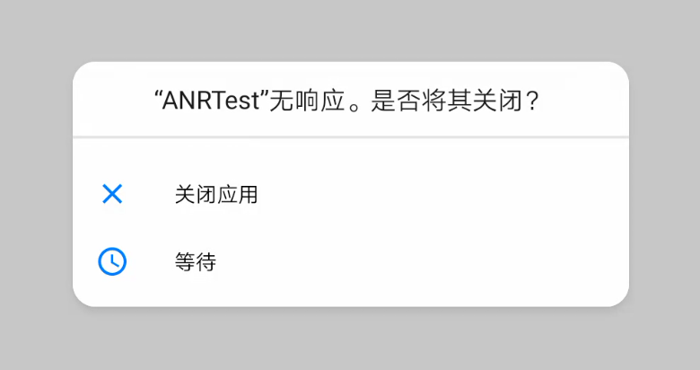
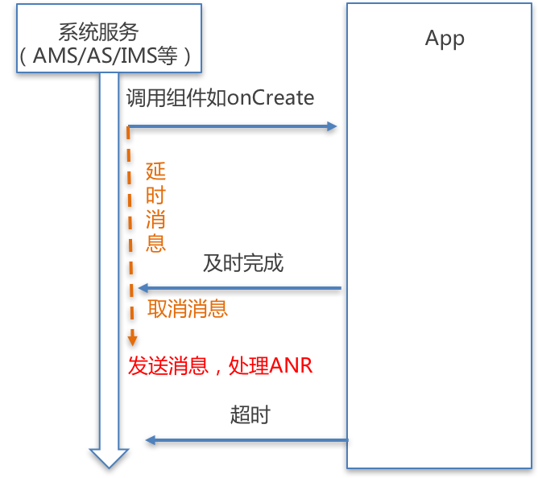

## 什么是 ANR

ANR(Application Not responding)，即应用程序无响应，简单来说，就是用户界面突然卡住，无法响应用户的操作（比如触摸事件）。

Android 系统对于一些事件需要在一定的时间范围内完成，如果超过预定时间能未能得到有效响应或者响应时间过长，都会造成 ANR。一般情况下，ANR 后会弹出一个提示框，告知用户当前应用无响应，用户可选择继续等待或者关闭应用。



## 出现场景

- **InputDispatching Timeout**：5 秒内无法响应屏幕触摸事件或键盘输入事件。

- **BroadcastQueue Timeout** ：在执行前台广播（BroadcastReceiver）的`onReceive()`函数时  10s 没有处理完成，后台为 60s。

- **Service Timeout** ：前台服务 20s 内，后台服务在 200s 内没有执行完毕。

- **ContentProvider Timeout** ：ContentProvider的 publish 在 10s 内没进行完。

## 如何避免

基本的思路就是将 IO 操作在工作线程来处理，减少其他耗时操作和错误操作。比如网络请求、Socket 通信、SQL操作、文件读写和或者有可能阻塞 UI 线程的操作放在子线程。

## ANR 分析

ANR 发生时 Logcat 会打印类似下面的日志：

```shell
/com.wuzy.anrtest I/zygote64: Thread[3,tid=6428,WaitingInMainSignalCatcherLoop,Thread*=0x7b3965ca00,peer=0x171c0020,"Signal Catcher"]: reacting to signal 3
/com.wuzy.anrtest I/zygote64: Wrote stack traces to '/data/anr/traces.txt'
/com.wuzy.anrtest I/Choreographer: Skipped 6000 frames!  The application may be doing too much work on its main thread.
```

每次产生 ANR 之后，系统都会向`/data/anr/traces.txt`中写入新的日志数据。

获取日志的命令：

```shell
adb shell
cat /data/anr/traces.txt > /mnt/sdcard/traces.txt
exit
adb pull /sdcard/traces.txt
```

这里我模拟一个 ANR 情况，在按钮点击事件中调用 `Thread.sleep`，查看 traces 文件内容，可以看到线程名、线程优先级、线程 ID、线程状态和 ANR 的原因。

```shell
----- pid 13872 at 2019-11-14 15:18:50 -----
Cmd line: com.wuzy.anrtest

...

"main" prio=5 tid=1 Sleeping
  | group="main" sCount=1 dsCount=0 flags=1 obj=0x735f1ad0 self=0x7b396a3a00
  | sysTid=13872 nice=-10 cgrp=default sched=0/0 handle=0x7b3e6f69b0
  | state=S schedstat=( 832049486 21080201 432 ) utm=77 stm=6 core=5 HZ=100
  | stack=0x7fe0065000-0x7fe0067000 stackSize=8MB
  | held mutexes=
  at java.lang.Thread.sleep(Native method)
  - sleeping on <0x026e2fdc> (a java.lang.Object)
  at java.lang.Thread.sleep(Thread.java:386)
  - locked <0x026e2fdc> (a java.lang.Object)
  at java.lang.Thread.sleep(Thread.java:327)
  at com.wuzy.anrtest.MainActivity$1.onClick(MainActivity.java:19)
  at android.view.View.performClick(View.java:6291)
  at android.view.View$PerformClick.run(View.java:24931)
  at android.os.Handler.handleCallback(Handler.java:808)
  at android.os.Handler.dispatchMessage(Handler.java:101)
  at android.os.Looper.loop(Looper.java:166)
  at android.app.ActivityThread.main(ActivityThread.java:7523)
  at java.lang.reflect.Method.invoke(Native method)
  at com.android.internal.os.Zygote$MethodAndArgsCaller.run(Zygote.java:245)
  at com.android.internal.os.ZygoteInit.main(ZygoteInit.java:921)
```

## ANR 监测机制

Android 应用程序是通过消息来驱动的，Android 某种意义上也可以说成是一个以消息驱动的系统，UI、事件、生命周期都和消息处理机制息息相关。Android 的 ANR 监测机制也是一样，大部分就是利用了 Android 的消息机制。 



在 Android 中，实际上是系统服务在控制每个组件的生命周期回调，所以可以在这个逻辑入口开始计时，利用 Handler 机制，发生延时消息，如果超时了，就处理 ANR 事件消息，如果没有超时，就取消队列里的延时消息，也就不会出现 ANR。

具体源码细节，推荐阅读：

[彻底理解安卓应用无响应机制]( http://gityuan.com/2019/04/06/android-anr/ )

[理解Android ANR的触发原理]( http://gityuan.com/2016/07/02/android-anr/ )

[理解Android ANR的信息收集过程]( http://gityuan.com/2016/12/02/app-not-response/ )