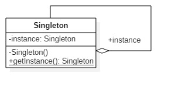

不管是在开发还是面试过程中，单例模式出现的频率都非常的高。但很多人对单例模式一知半解，单例模式的写法非常多，不同写法的区别很大，这篇文章的目的是带你深入学习一下单例模式。

## 什么是单例模式

单例模式是一种对象创建型模式，用来编写一个类，在整个应用系统中只能有该类的一个实例对象。  

UML 结构图：



单例模式的三要点：

1、某个类只能有一个实例

2、必须自行创建这个实例

3、必须自行向整个系统提供这个实例

## 单例模式的特点

优点：

使用单例模式可以减少内存的开销，避免了对象实例的频繁创建和销毁。

缺点：

- 由于单例模式中没有抽象层，因此单例类的扩展有很大的困难。 

- 单例类的职责过重，在一定程度上违背了"单一职责原则"。 

## 单例模式的各种写法

**1、饿汉式单例类**

饿汉式比较简单，对象在类加载时就实例化，因此称为饿汉式单例类。

```java
public class Singleton {  
    
     private static Singleton instance = new Singleton();  
    
     private Singleton (){}
    
     public static Singleton getInstance() {  
    	 return instance;  
     }  
 }
```


优点：线程安全，没有加锁，执行效率高。

缺点：未使用单例类时，造成内存浪费。

**2、懒汉式单例类**

在需要使用单例类时在创建实例对象，所有称为懒汉式单例类。

```java
public class Singleton {
 
    private static Singleton instance;
 
    private Singleton (){}
     
    public static Singleton getInstance() {
 
        if (instance == null) {
            instance = new Singleton();
        }
 
        return instance;
    }
 
}
```

优点：节约内存

缺点：线程不安全，多线程可能会创建多个实例

**3、同步方法的懒汉式单例类**

在 `getInstance()` 方法前增加关键字 synchronized。

```java
public class Singleton {
 
    private static Singleton instance;
 
    private Singleton (){}
 
    public static synchronized Singleton getInstance() {
 
        if (instance == null) {
            instance = new Singleton();
        }
 
        return instance;
    }
 
}
```

优点：解决了线程安全问题

缺点：除了第一次调用 `getInstance()`需要同步，后面的调用造成不必要的同步开销，不建议用这种模式。 

**4、 双重检查锁定** 

这种写法是在 `getInstance()` 方法中进行两次判空，缩小同步锁的粒度。

```java
public class Singleton {
 
    private volatile static Singleton singleton;
 
    private Singleton (){}
 
    public static Singleton getInstance() {
 
        if (singleton == null) {
            synchronized (Singleton.class) {
                if (singleton == null) {
                    singleton = new Singleton();
                 }
             }
        }
 
        return singleton;
    }
 
}
```

第二个判空是必要的，原因如下：

假如某一瞬间线程 A 和线程 B 都在调用`getInstance()` 方法，此时 instance 对象为 null，均能通过 “ instance == null ” 的判断。线程 A 进入 synchronized 锁定的代码中执行实例创建代码，线程 B 处于排队等待状态。当 A 执行完毕创建了实例后，线程 B 进入 synchronized 代码，此时 B 并不知道实例已经创建，将创建新的实例。 

因此需要在 synchronized 锁定代码中再进行一次判空处理，这种方式称为双重检查锁定。实例变量需要加 volatile 关键字保证易变可见性，JDK1.5 起才可用。 

优点：一定程度上解决了资源的消耗和多余的加锁同步，线程安全等问题。

缺点：由于 volatile 关键字会屏蔽 Java 虚拟机所做的一些代码优化，可能会导致系统运行效率降低。

**5、静态内部类单例模式**

同样利用了 JVM 类加载机制来保证初始化实例对象时只有一个线程，静态内部类 SingletonHolder 类只有第一次调用 `getInstance()` 方法时，才会装载从而实例化对象。 

```java
public class Singleton {
 
    private static class SingletonHolder {
 
       private static final Singleton INSTANCE = new Singleton();
    }
 
    private Singleton (){}
 
    public static final Singleton getInstance() {
 
        return SingletonHolder.INSTANCE;
    }
 
} 
```

优点：解决了线程安全问题，延迟加载、节省内存，性能优于上述几种实现方式。

**6、枚举方式**

定义一个枚举的元素，就代表 Singleton 实例。

```java
public enum Singleton {
 
    INSTANCE;
 
    /*
    **调用方式：Singleton.INSTANCE.doSomethingMethod();
    */
    public void doSomethingMethod() {
 
    }
 
} 
```

优点：线程安全，防止反序列化或者反射攻击时实例重新创建。

## 如何避免 Java 反射破坏单例模式

上面 6 种 Java 单例模式实现方式除枚举方式外，其他几种依然可以通过相关反射方法，改变其权限，创建多个实例，代码如下：

```java
public class Test {
 
    public static void main(String args[]) {
     
        Singleton singleton = Singleton.getInstance();
 
       try {
 
            Constructor<Singleton> constructor = Singleton.class.getDeclaredConstructor();
            constructor.setAccessible(true);
            Singleton singletonnew = constructor.newInstance();
            System.out.println(singleton == singletonnew);   // 输出结果：false

        } catch (Exception e) {
 
        }     
    }
}
```

如何避免 Java 反射破坏单例模式呢？可以在构造函数里面进行判断：如果当前已有实例，通过抛出异常来阻止反射创建对象。

```java
private Singleton() {
 
    if (null != Singleton.singleton) {
        throw new RuntimeException();
    }
}
```

## 如何避免 Java 反序列化破坏单例模式

除了反射，反序列化也可能破坏单例模式，反序列化会通过反射调用无参数的构造方法创建一个新的对象。 

```java
public class Test {
    public static void main(String[] args) {
        try (ObjectOutputStream oos = new ObjectOutputStream(new FileOutputStream("tempFile"));
             ObjectInputStream ois = new ObjectInputStream(new FileInputStream("tempFile"))) {
            oos.writeObject(Singleton.getInstance());
            Singleton newInstance = (Singleton) ois.readObject();
            System.out.println(newInstance == Singleton.getInstance()); // 输出 false
        } catch (Exception ex) {
            ex.printStackTrace();
        }
    }

}
```

解决方法是只要在 Singleton 类中定义 `readResolve()` 方法即可。

```java
public class Singleton implements Serializable {

    private volatile static Singleton singleton;

    private Singleton (){}

    public static Singleton getInstance() {

        if (singleton == null) {
            synchronized (Singleton.class) {
                if (singleton == null) {
                    singleton = new Singleton();
                }
            }
        }

        return singleton;
    }

    private Object readResolve() {
        return singleton;
    }
}
```

