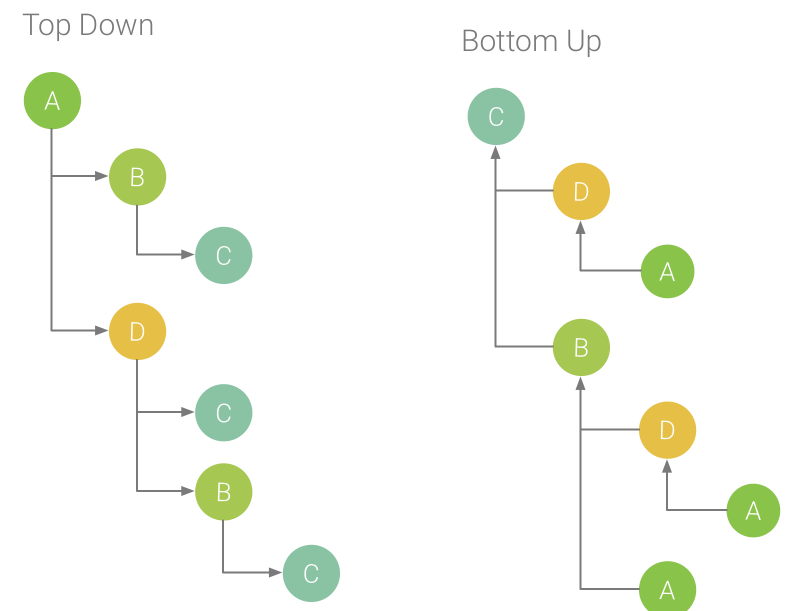

---

title: Android 应用启动速度优化
date: 2019-09-09 10:55:36
tags: 
- 性能优化
- TraceView
- Systrace
categories: Android记录
---

应用启动时间的长短，影响到用户体验。对研发人员来说，启动速度是我们的“门面”。

本文主要记录 Android 应用启动速度优化学习笔记。

## 应用启动类型

应用的启动流程即从点击图标到用户可操作的全部过程。启动分为三种类型：

- **冷启动**：当启动应用时，后台没有该应用的进程，这时系统会首先会创建一个新的进程分配给该应用。

- **热启动**：当启动应用时，后台已有该应用的进程，比如按下 home 键。

- **温启动**：当启动应用时，后台已有该应用的进程，但是启动的入口 Activity 被干掉了，比如按了 back 键，应用虽然退出了，但是该应用的进程是依然会保留在后台。

其中启动最慢的就是冷启动，系统和应用本身的工作都是从零开始。

冷启动开始时，系统有三个任务：

- 启动 App

- App 启动后显示一个空白的 Window

- 创建 App 的进程

在此之后，应用进程马上会执行以下任务：

- 创建 App 对象

- 启动 main thread

- 创建要启动的 Activity

- 加载 View

- 布置页面

- 进行第一次绘制

## 测量时间方式

### adb 命令

使用 adb shell 获取应用启动时间：

```shell
adb shell am start -W [packageName]/[packageName.AppstartActivity]
```

输出的结果类似于：

```shell
$ adb shell am start -W com.speed.test/com.speed.test.HomeActivity
Starting: Intent { act=android.intent.action.MAIN cat=[android.intent.category.LAUNCHER] cmp=com.speed.test/.HomeActivity }
Status: ok
Activity: com.speed.test/.HomeActivity
ThisTime: 496    
TotalTime: 496
WaitTime: 503
Complete
```

- ThisTime： 代表一连串启动 Activity 的最后一个 Activity 的启动耗时。
- TotalTime 表示新应用启动的耗时，包括新进程的启动和 Activity 的启动，但不包括前一个应用 Activity `pause` 的耗时。
- WaitTime 返回从 `startActivity` 到应用第一帧完全显示这段时间。 就是总的耗时，包括前一个应用 Activity `pause` 的时间和新应用启动的时间。

一般只需关注 TotalTime，即应用自身真正的启动耗时。

缺点：adb 命令无法精确查看方法具体耗费的时间，局限性比较大。

### AOP 

> AOP : Aspect Oriented Programming的缩写，意为：面向切面编程

优点：

1. 针对同一问题的统一处理
2. 无侵入添加代码

Android 中使用 AspecJ 实现 AOP。详细内容看这篇文章：[Android AspectJ 学习笔记](https://wuzhangyang.com/2020/06/03/aspectj/)

项目根目录的 build.gradle 添加

```
buildscript {
    ...
    dependencies {
        ...
        classpath 'com.hujiang.aspectjx:gradle-android-plugin-aspectjx:2.0.0'
    }
}
```

app 项目的 build.gradle 新建的 module的 build.gradle 里添加

```
apply plugin: 'android-aspectjx'

dependencies {
    ...
    api 'org.aspectj:aspectjrt:1.9.5'
}
```

MyApplication 代码

```java
public class MyApplication extends Application {

    @Override
    public void onCreate() {
        super.onCreate();

        initBugly();
        initBaiduMap();
        initJPushInterface();
        initShareSDK();

    }

    private void initBugly() {
        try {
            Thread.sleep(1000); // 模拟耗费的时间
        } catch (InterruptedException e) {
            e.printStackTrace();
        }
    }

    private void initBaiduMap() {
        try {
            Thread.sleep(2000); // 模拟耗费的时间
        } catch (InterruptedException e) {
            e.printStackTrace();
        }
    }

    private void initJPushInterface() {
        try {
            Thread.sleep(3000); // 模拟耗费的时间
        } catch (InterruptedException e) {
            e.printStackTrace();
        }
    }

    private void initShareSDK() {
        try {
            Thread.sleep(500); // 模拟耗费的时间
        } catch (InterruptedException e) {
            e.printStackTrace();
        }
    }
}
```

创建切面

```java
@Aspect
public class PerformanceAspect {
    private static final String TAG = "PerformanceAspect";

    @Around("call(* com.wuzy.aspectjdemo.MyApplication.**(..))")
    public void getTime(ProceedingJoinPoint joinPoint) {
        long startTime = System.currentTimeMillis();
        String methodName = joinPoint.getSignature().getName();
        try {
            joinPoint.proceed();
        } catch (Throwable throwable) {
            throwable.printStackTrace();
        }
        Log.e(TAG, methodName + "方法耗时：" + (System.currentTimeMillis() - startTim
                                          e));
    }
}
```

无需修改任何工程代码，就可以获取运行时长了


### TraceView

[TraceView](https://developer.android.google.cn/studio/profile/generate-trace-logs) 是 Android SDK 内置的一个工具，它可以加载 trace 文件，用图形的形式展示代码的执行时间、次数及调用栈。

使用方式

```java
Debug.startMethodTracing("文件名");

Debug.stopMethodTracing();
```

代码运行后，会在

```java
mnt/sdcard/Android/data/包名/files
```

生成一个`.trace`后缀的文件，然后可以用 Android Studio 的 Profiler 添加打开它。


**Wall Clock Time**：表示实际经过的时间。包含线程在阻塞和等待的时间。

**Thread Time**：表示实际经过的时间减去线程没有占用 CPU 资源的那部分时间。

**Flame Chart**：火焰图。y 轴表示调用栈，每一层都是一个函数。调用栈越深，火焰就越高，顶部就是正在执行的函数，下方都是它的父函数。 x 轴表示抽样数，如果一个函数在 x 轴占据的宽度越宽，就表示它被抽到的次数多，即执行的时间长。注意，x 轴不代表时间，而是所有的调用栈合并后，按字母顺序排列的。

> 火焰图就是看顶层的哪个函数占据的宽度最大。只要有"平顶"（plateaus），就表示该函数可能存在性能问题。

**Top Down**：显示一个函数调用列表，在该列表中展开函数节点会显示函数的被调用方。

**Bottom Up**：显示一个函数调用列表，在该列表中展开函数节点将显示函数的调用方。



**缺点**：traceView 的原理就是抓取所有线程的所有函数里的信息，所以会导致程序变慢，工具本身带来的性能开销过大，有时无法反映真实的情况。比如一个函数本身的耗时是 1 秒，开启 TraceView 后可能会变成 5 秒。

### Systrace + 函数插桩

Systrace 原理：在系统的一些关键链路（如SystemServcie、虚拟机、Binder驱动）插入一些信息（Label），
通过 Label 的开始和结束来确定某个核心过程的执行时间，然后把这些Label信息收集起来得到系统关键路径的运行时间信息，最后得到整个系统的运行性能信息。Android Framework 里面一些重要的模块都插入了 label 信息(Java 层通过 android.os.Trace 类完成，native层通过 ATrace 宏完成），用户 App 中可以添加自定义的 Lable，这样就组成了一个完成的性能分析系统。

具体使用教程可以看这篇文章：[手把手教你使用Systrace（一）](https://zhuanlan.zhihu.com/p/27331842)

Systrace 的优点：

- 可以看大整个流程系统和应用程序的调用流程。包括系统关键线程的函数调用，渲染耗时、线程锁、GC 耗时等。
- 性能损耗可以接受。

## 异步优化

异步优化的核心思想：子线程来分担主线程的任务，并减少运行时间。

### FixThreadPool

线程池核心个数

```java
// 获得当前CPU的核心数
private static final int CPU_COUNT = Runtime.getRuntime().availableProcessors();

// 设置线程池的核心线程数2-4之间,但是取决于CPU核数
private static final int CORE_POOL_SIZE = Math.max(2, Math.min(CPU_COUNT - 1, 4));
```

创建线程池

```java
// 创建线程池
ExecutorService executorService = Executors.newFixedThreadPool(CORE_POOL_SIZE);
```

将耗时方法放在线程池中，不影响主线程页面加载。对于必须要先执行完毕才能进入页面的情况，使用 CountDownLatch 处理。

MyApplication#onCreate：

```java
 @Override
    public void onCreate() {
        super.onCreate();
//        Debug.startMethodTracing();

        final CountDownLatch latch = new CountDownLatch(1);
        ExecutorService executorService = Executors.newFixedThreadPool(CORE_POOL_SIZE);

        executorService.submit(new Runnable() {
            @Override
            public void run() {
                initBugly();
                latch.countDown();
            }
        });
        executorService.submit(new Runnable() {
            @Override
            public void run() {
                initBaiduMap();
            }
        });
        executorService.submit(new Runnable() {
            @Override
            public void run() {
                initJPushInterface();
            }
        });
        executorService.submit(new Runnable() {
            @Override
            public void run() {
                initShareSDK();
            }
        });

        try {
            latch.await();
        } catch (InterruptedException e) {
            e.printStackTrace();
        }

//        Debug.stopMethodTracing();
    }
```

上面代码中：只有在 `initBugly` 执行完毕后才能跳转页面，而  `initBugly`  是可以在子线程执行，所以可以采用线程池 + CountDownLatch 实现。

但是，对于多个耗时任务存在依赖关联，比如必须先执行完A，根据A的返回值，再执行B，然后根据B的返回再执行C，任务串联的情况，使用线程池 + CountDownLatch  就比较麻烦。

### 启动器

先将任务分类：


- head task : 我们会把一些必须先启动的task放到这里

- 主线程：将必须要在主线程中初始化的task放入这里

- 并发：将非必须在主线程中初始化的task放入这里

- tail task: 一些在所有任务执行完毕之后才去初始化的放入这里，比如一些log打印等

- ilde task: 通过字面就知道了将一些可以有空再初始化的task放入这里

启动器的目的就是保证并发任务的执行顺序的正确性。任务执行顺序的排序采用：**有向无环图的[拓扑排序](https://www.jianshu.com/p/b59db381561a)**

**拓扑排序（Topological Sorting**）是一个有向无环图（DAG, Directed Acyclic Graph）的所有顶点的线性序列。

且该序列必须满足下面两个条件：

- 每个顶点出现且只出现一次。

- 若存在一条从顶点 A 到顶点 B 的路径，那么在序列中顶点 A 出现在顶点 B 的前面。

**拓扑排序的写法思路：**

1、从 DAG 图中选择一个 没有前驱（即入度为0）的顶点并输出。

2、从图中删除该顶点和所有以它为起点的有向边。

3、重复 1 和 2 直到当前的 DAG 图为空或当前图中不存在无前驱的顶点为止。后一种情况说明有向图中必然存在环。


于是，得到拓扑排序后的结果是 { 1, 2, 4, 3, 5 }。

启动器外部调用：

```java
 TaskDispatcher instance = TaskDispatcher.createInstance();
        instance.addTask(new InitBuglyTask()) // 默认添加，并发处理
                .addTask(new InitBaiduMapTask())  // 在这里需要先处理了另外一个耗时任务initShareSDK，才能再处理它
                .addTask(new InitJPushTask())  // 等待主线程处理完毕，再进行执行
                .start();
        instance.await();
```

启动器主要流程：


具体代码：[PerformanceDemo](https://github.com/zywudev/PerformanceDemo)


## 启动窗口优化

使用 Activity 的 windowBackground 属性为启动的 Activity 提供一个闪屏预览界面（layer-list），这样点击应用图标会立马显示闪屏界面。具体操作方法：

Layout XML：

```xml
<layer-list xmlns:android="http://schemas.android.com/apk/res/android" android:opacity="opaque">
  <!-- 背景颜色 -->
  <item android:drawable="@android:color/white"/>
  <!-- 闪屏页图片 -->
  <item>
    <bitmap
      android:src="@drawable/product_logo_144dp"
      android:gravity="center"/>
  </item>
</layer-list>
```

style：

```xml
<style name="AppTheme.Launcher">
    <item name="android:windowFullscreen">true</item>
    <item name="android:windowBackground">@mipmap/layer-list</item>
</style>
```

Manifest：

```xml
<activity ...
android:theme="@style/AppTheme.Launcher" />
```

Activity：

```java
public class MyMainActivity extends AppCompatActivity {
  @Override
  protected void onCreate(Bundle savedInstanceState) {
    // 替换回原来的主题，注意在 super.onCreate 之前调用
    setTheme(R.style.Theme_MyApp);
    super.onCreate(savedInstanceState);
    // ...
  }
}
```

这种方案在通过交互体验优化了展示效果，但并没有真正的加速启动。

对于中低端机，总的闪屏时间会更长，建议在 Android 6.0 或者 Android 7.0 以上才启用“闪屏优化” 方案。

## 延迟初始化

首页渲染完成后，再初始化数据，也就是延迟初始化，目的就是让界面先显示出来，保证 UI 绘制的流畅性。

核心方法是在 Activity 的 `onCreate` 函数中加入下面的方法 ：

```java
getWindow().getDecorView().post(new Runnable() {
    @Override
    public void run() {
        myHandler.post(mLoadingRunnable);
    }
});
```

这里的 `run` 方法是在 Activity 的 `onResume` 之后执行的。

关于这种方案的机制参见 ：[Android 应用启动优化:一种 DelayLoad 的实现和原理(上篇)](https://www.androidperformance.com/2015/11/18/Android-app-lunch-optimize-delay-load/)

## 建议

1、减少布局层级，建议使用约束布局 ConstraintLayout。

2、去掉无用代码、重复逻辑。

3、避免 Application 中创建线程池，尽量延迟操作。

4、避免启动过多工作线程。

5、尽量减少 GC 的次数，避免造成主线程长时间的卡顿。

6、一句话准则：可以异步的都异步，不可以异步的尽量延迟。

## 参考

https://www.androidperformance.com/2015/11/18/Android-app-lunch-optimize-delay-load/

https://www.jianshu.com/p/f5514b1a826c

https://www.androidperformance.com/2015/11/18/Android-app-lunch-optimize-delay-load/

https://developer.android.google.cn/topic/performance/launch-time.html

https://zhuanlan.zhihu.com/p/27331842

https://juejin.im/user/5d618e106fb9a06b084d0073/posts