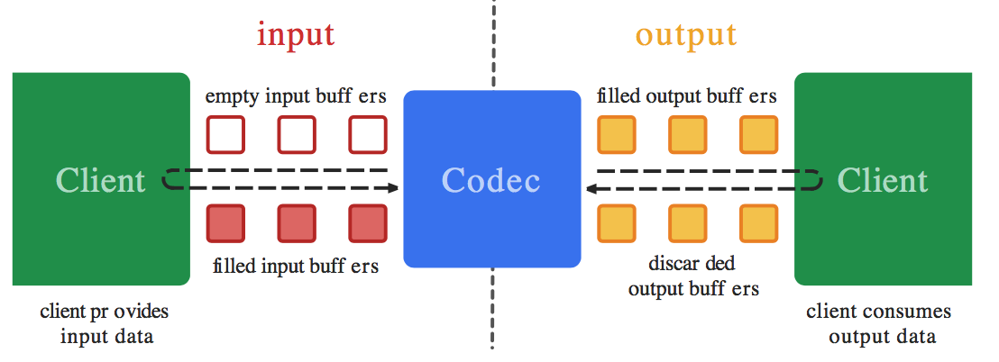
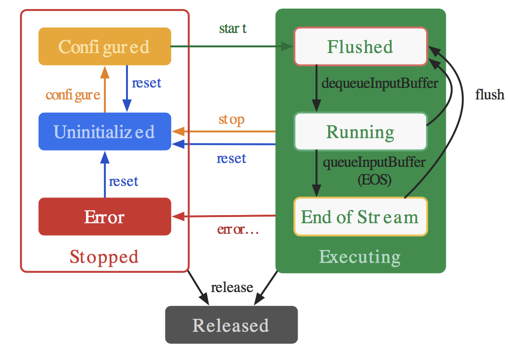

这篇文章主要来学习下使用 MediaCodec API 进行音频的编解码。

## 什么是编码、解码？

音视频领域，我们常说的 **编码** 就是压缩，**解码** 就是解压缩。

编码的目的是减小数据的体积，减少存储空间和传输已存储文件所需的带宽。

编码后的数据是不能直接使用的，必须先解码成原来的样子。就像 zip 压缩文件里面有张图片，我们用图片查看器是无法打开的，必须先解压文件，恢复图片原来的数据，这样才能查看。音视频编解码也是同样的道理。

## MediaCodec

我们了解一下 Android 官方提供的音频编解码的 API，即 MediaCodec 类，该 API 是在 Andorid 4.1 （API 16） 版本引入的，因此只能工作于 Android 4.1 以上的手机上。

MediaCodec 采用了基于环形缓冲区的「生产者-消费者」模型，异步处理数据。在 input 端，Client 是这个环形缓冲区「生产者」，MediaCodec 是「消费者」。在 output 端，MediaCodec 是这个环形缓冲区「生产者」，而 Client 则变成了「消费者」。

工作流程是这样的：

（1）Client 从 input 缓冲区队列申请 empty buffer [dequeueInputBuffer]

（2）Client 把需要编解码的数据拷贝到 empty buffer，然后放入 input 缓冲区队列 [queueInputBuffer]

（3）MediaCodec 从 input 缓冲区队列取一帧数据进行编解码处理

（4）处理结束后，MediaCodec 将原始数据 buffer 置为 empty 后放回 input 缓冲区队列，将编解码后的数据放入到 output 缓冲区队列

（5）Client 从 output 缓冲区队列申请编解码后的 buffer [dequeueOutputBuffer]

（6）Client 对编解码后的 buffer 进行渲染/播放

（7）渲染/播放完成后，Client 再将该 buffer 放回 output 缓冲区队列 [releaseOutputBuffer]



MediaCodec 使用的基本流程是：

```java
- createEncoderByType/createDecoderByType
- configure
- start
- while(1) {
    - dequeueInputBuffer
    - queueInputBuffer
    - dequeueOutputBuffer
    - releaseOutputBuffer
}
- stop
- release
```

MediaCodec 的生命周期有三种状态：**停止态-Stopped、执行态-Executing、释放态-Released**。

停止状态（Stopped）包括了三种子状态：未初始化（Uninitialized）、配置（Configured）、错误（Error）。

执行状态（Executing）会经历三种子状态：刷新（Flushed）、运行（Running）、流结束（End-of-Stream）




（1）当创建编解码器的时候处于未初始化状态。首先你需要调用 configure(…) 方法让它处于 Configured 状态，然后调用 start() 方法让其处于 Executing 状态。在 Executing 状态下，你就可以使用上面提到的缓冲区来处理数据。

（2）Executing 的状态下也分为三种子状态：Flushed, Running、End-of-Stream。在 start() 调用后，编解码器处于 Flushed 状态，这个状态下它保存着所有的缓冲区。一旦第一个输入 buffer 出现了，编解码器就会自动运行到 Running 的状态。当带有 end-of-stream 标志的 buffer 进去后，编解码器会进入 End-of-Stream 状态，这种状态下编解码器不在接受输入 buffer，但是仍然在产生输出的 buffer。此时你可以调用 flush() 方法，将编解码器重置于 Flushed 状态。

（3）调用 stop() 将编解码器返回到未初始化状态，然后可以重新配置。 完成使用编解码器后，您必须通过调用 release() 来释放它。

（4）在极少数情况下，编解码器可能会遇到错误并转到错误状态。 这是使用来自排队操作的无效返回值或有时通过异常来传达的。 调用 reset() 使编解码器再次可用。 您可以从任何状态调用它来将编解码器移回未初始化状态。 否则，调用 release() 动到终端释放状态。

## AAC 编解码

对音频进行编码的目的用更少的空间来存储和传输，有有损编码和无损编码，其中我们常见的 Mp3 和 ACC 格式就是有损编码。

ACC 音频有 ADIF 和 ADTS 两种格式，第一种适用于磁盘，优点是需要空间小，但是不能边下载边播放；第二种则适用于流的传输，它是一种帧序列，可以逐帧播放。我们这里用 ADTS 这种来进行编码。

**ADTS 帧结构：**

head :: body

**ADTS 帧首部结构：**

| **序号** | **域**                          | **长度（bits）** | **说明**                                                     |
| -------- | ------------------------------- | ---------------- | ------------------------------------------------------------ |
| 1        | Syncword                        | 12               | all bits **must** be 1                                       |
| 2        | MPEG version                    | 1                | 0 for MPEG-4, 1 for MPEG-2                                   |
| 3        | Layer                           | 2                | always 0                                                     |
| 4        | Protection Absent               | 1                | et to 1 if there is no CRC and 0 if there is CRC             |
| 5        | Profile                         | 2                | the [MPEG-4 Audio Object Type](http://wiki.multimedia.cx/index.php?title=MPEG-4_Audio#Audio_Object_Types) minus 1 |
| 6        | MPEG-4 Sampling Frequency Index | 4                | [MPEG-4 Sampling Frequency Index](http://wiki.multimedia.cx/index.php?title=MPEG-4_Audio#Sampling_Frequencies) (15 is forbidden) |
| 7        | Private Stream                  | 1                | set to 0 when encoding, ignore when decoding                 |
| 8        | MPEG-4 Channel Configuration    | 3                | [MPEG-4 Channel Configuration](http://wiki.multimedia.cx/index.php?title=MPEG-4_Audio#Channel_Configurations) (in the case of 0, the channel configuration is sent via an inband PCE) |
| 9        | Originality                     | 1                | set to 0 when encoding, ignore when decoding                 |
| 10       | Home                            | 1                | set to 0 when encoding, ignore when decoding                 |
| 11       | Copyrighted Stream              | 1                | set to 0 when encoding, ignore when decoding                 |
| 12       | Copyrighted Start               | 1                | set to 0 when encoding, ignore when decoding                 |
| 13       | Frame Length                    | 13               | this value must include 7 or 9 bytes of header length: FrameLength = (ProtectionAbsent == 1 ? 7 : 9) + size(AACFrame) |
| 14       | Buffer Fullness                 | 11               | buffer fullness                                              |
| 15       | Number of AAC Frames            | 2                | number of AAC frames (RDBs) in ADTS frame **minus 1**, for maximum compatibility always use 1 AAC frame per ADTS frame |
| 16       | CRC                             | 16               | CRC if *protection absent* is 0                              |

编解码代码：

```java
/**
 * AAC 编解码
 */
public class AacPcmCoder {
    private static final String TAG = "AacPcmCoder";
    private final static String AUDIO_MIME = "audio/mp4a-latm";
    private final static long AUDIO_BYTES_PER_SAMPLE = 44100 * 1 * 16 / 8;

    /**
     * PCM 编码为 AAC 格式
     *
     * @param inPcmFile
     * @param outAacFile
     * @throws IOException
     */
    public static void encodePcmToAac(File inPcmFile, File outAacFile) throws IOException {
        FileInputStream fisRawAudio = null;
        FileOutputStream fosAccAudio = null;
        MediaCodec audioEncoder = createAudioEncoder();

        try {
            fisRawAudio = new FileInputStream(inPcmFile);
            fosAccAudio = new FileOutputStream(outAacFile);
            // 开始编码
            audioEncoder.start();
            ByteBuffer[] audioInputBuffers = audioEncoder.getInputBuffers();
            ByteBuffer[] audioOutputBuffers = audioEncoder.getOutputBuffers();
            boolean sawInputEOS = false;
            boolean sawOutputEOS = false;
            long audioTimeUs = 0;
            MediaCodec.BufferInfo outBufferInfo = new MediaCodec.BufferInfo();
            boolean readRawAudioEOS = false;
            byte[] rawInputBytes = new byte[8192];
            int readRawAudioCount;
            int rawAudioSize = 0;
            long lastAudioPresentationTimeUs = 0;
            int inputBufIndex, outputBufIndex;
            while (!sawOutputEOS) {
                if (!sawInputEOS) {
                    inputBufIndex = audioEncoder.dequeueInputBuffer(10_000);
                    if (inputBufIndex >= 0) {
                        ByteBuffer inputBuffer = audioInputBuffers[inputBufIndex];
                        inputBuffer.clear();
                        int bufferSize = inputBuffer.remaining();
                        if (bufferSize != rawInputBytes.length) {
                            rawInputBytes = new byte[bufferSize];
                        }

                        readRawAudioCount = fisRawAudio.read(rawInputBytes);
                        if (readRawAudioCount == -1) {
                            readRawAudioEOS = true;
                        }

                        if (readRawAudioEOS) {
                            audioEncoder.queueInputBuffer(inputBufIndex, 0, 0, 0, MediaCodec.BUFFER_FLAG_END_OF_STREAM);
                            sawInputEOS = true;
                        } else {
                            inputBuffer.put(rawInputBytes, 0, readRawAudioCount);
                            rawAudioSize += readRawAudioCount;
                            audioEncoder.queueInputBuffer(inputBufIndex, 0, readRawAudioCount, audioTimeUs, 0);
                            audioTimeUs = (long) (1_000_000 * ((float) rawAudioSize / AUDIO_BYTES_PER_SAMPLE));
                        }
                    }
                }

                outputBufIndex = audioEncoder.dequeueOutputBuffer(outBufferInfo, 10_000);
                if (outputBufIndex >= 0) {
                    // Simply ignore codec config buffers.
                    if ((outBufferInfo.flags & MediaCodec.BUFFER_FLAG_CODEC_CONFIG) != 0) {
                        Log.i(TAG, "audio encoder: codec config buffer");
                        audioEncoder.releaseOutputBuffer(outputBufIndex, false);
                        continue;
                    }
                    if (outBufferInfo.size != 0) {
                        ByteBuffer outBuffer = audioOutputBuffers[outputBufIndex];
                        outBuffer.position(outBufferInfo.offset);
                        outBuffer.limit(outBufferInfo.offset + outBufferInfo.size);
                        if (lastAudioPresentationTimeUs <= outBufferInfo.presentationTimeUs) {
                            lastAudioPresentationTimeUs = outBufferInfo.presentationTimeUs;
                            int outBufSize = outBufferInfo.size;
                            int outPacketSize = outBufSize + 7;
                            outBuffer.position(outBufferInfo.offset);
                            outBuffer.limit(outBufferInfo.offset + outBufSize);
                            byte[] outData = new byte[outPacketSize];
                            addADTStoPacket(outData, outPacketSize);
                            outBuffer.get(outData, 7, outBufSize);
                            fosAccAudio.write(outData, 0, outData.length);
                            //Log.v(TAG, outData.length + " bytes written.");
                        } else {
                            Log.e(TAG, "error sample! its presentationTimeUs should not lower than before.");
                        }
                    }
                    audioEncoder.releaseOutputBuffer(outputBufIndex, false);
                    if ((outBufferInfo.flags & MediaCodec.BUFFER_FLAG_END_OF_STREAM) != 0) {
                        sawOutputEOS = true;
                    }
                } else if (outputBufIndex == MediaCodec.INFO_OUTPUT_BUFFERS_CHANGED) {
                    audioOutputBuffers = audioEncoder.getOutputBuffers();
                } else if (outputBufIndex == MediaCodec.INFO_OUTPUT_FORMAT_CHANGED) {
                    MediaFormat audioFormat = audioEncoder.getOutputFormat();
                    Log.i(TAG, "format change : " + audioFormat);
                }
            }
        } finally {
            Log.i(TAG, "encodePcmToAac: finish");
            if (fisRawAudio != null) {
                fisRawAudio.close();
            }
            if (fosAccAudio != null) {
                fosAccAudio.close();
            }
            audioEncoder.release();
        }
    }

    /**
     * AAC 解码至 PCM 格式
     * @param aacFile
     * @param pcmFile
     * @throws IOException
     */
    public static void decodeAacTomPcm(File aacFile, File pcmFile) throws IOException{
        MediaExtractor extractor = new MediaExtractor();
        extractor.setDataSource(aacFile.getAbsolutePath());
        MediaFormat mediaFormat = null;
        for (int i = 0; i < extractor.getTrackCount(); i++) {
            MediaFormat format = extractor.getTrackFormat(i);
            String mime = format.getString(MediaFormat.KEY_MIME);
            if (mime.startsWith("audio/")) {
                extractor.selectTrack(i);
                mediaFormat = format;
                break;
            }
        }
        if (mediaFormat == null) {
            Log.e(TAG, "Invalid file with audio track.");
            extractor.release();
            return;
        }

        FileOutputStream fosDecoder = new FileOutputStream(pcmFile);
        String mediaMime = mediaFormat.getString(MediaFormat.KEY_MIME);
        Log.i(TAG, "decodeAacToPcm: mimeType: " + mediaMime);
        MediaCodec codec = MediaCodec.createDecoderByType(mediaMime);
        codec.configure(mediaFormat, null, null, 0);
        codec.start();
        ByteBuffer[] codecInputBuffers = codec.getInputBuffers();
        ByteBuffer[] codecOutputBuffers = codec.getOutputBuffers();
        final long kTimeOutUs = 10_000;
        MediaCodec.BufferInfo info = new MediaCodec.BufferInfo();
        boolean sawInputEOS = false;
        boolean sawOutputEOS = false;

        try {
            while (!sawOutputEOS) {
                if (!sawInputEOS) {
                    int inputBufIndex = codec.dequeueInputBuffer(kTimeOutUs);
                    if (inputBufIndex >= 0) {
                        ByteBuffer dstBuf = codecInputBuffers[inputBufIndex];
                        int sampleSize = extractor.readSampleData(dstBuf, 0);
                        if (sampleSize < 0) {
                            Log.i(TAG, "saw input EOS.");
                            sawInputEOS = true;
                            codec.queueInputBuffer(inputBufIndex, 0, 0, 0, MediaCodec.BUFFER_FLAG_END_OF_STREAM);
                        } else {
                            codec.queueInputBuffer(inputBufIndex, 0, sampleSize, extractor.getSampleTime(), 0);
                            extractor.advance();
                        }
                    }
                }

                int outputBufferIndex = codec.dequeueOutputBuffer(info, kTimeOutUs);
                if (outputBufferIndex >= 0) {
                    // Simply ignore codec config buffers.
                    if ((info.flags & MediaCodec.BUFFER_FLAG_CODEC_CONFIG) != 0) {
                        Log.i(TAG, "audio encoder: codec config buffer");
                        codec.releaseOutputBuffer(outputBufferIndex, false);
                        continue;
                    }

                    if (info.size != 0) {
                        ByteBuffer outBuf = codecOutputBuffers[outputBufferIndex];
                        outBuf.position(info.offset);
                        outBuf.limit(info.offset + info.size);
                        byte[] data = new byte[info.size];
                        outBuf.get(data);
                        fosDecoder.write(data);
                    }

                    codec.releaseOutputBuffer(outputBufferIndex, false);
                    if ((info.flags & MediaCodec.BUFFER_FLAG_END_OF_STREAM) != 0) {
                        Log.i(TAG, "saw output EOS.");
                        sawOutputEOS = true;
                    }
                } else if (outputBufferIndex == MediaCodec.INFO_OUTPUT_BUFFERS_CHANGED) {
                    codecOutputBuffers = codec.getOutputBuffers();
                    Log.i(TAG, "output buffers have changed.");
                } else if (outputBufferIndex == MediaCodec.INFO_OUTPUT_FORMAT_CHANGED) {
                    MediaFormat oformat = codec.getOutputFormat();
                    Log.i(TAG, "output format has changed to " + oformat);
                }
            }
        } finally {
            Log.i(TAG, "decodeAacToPcm finish");
            codec.stop();
            codec.release();
            extractor.release();
            fosDecoder.close();
        }
    }

    /**
     * 创建编码器
     * @return
     * @throws IOException
     */
    private static MediaCodec createAudioEncoder() throws IOException {
        MediaCodec codec = MediaCodec.createEncoderByType(AUDIO_MIME);
        MediaFormat format = new MediaFormat();
        format.setString(MediaFormat.KEY_MIME, AUDIO_MIME);
        format.setInteger(MediaFormat.KEY_BIT_RATE, 64000);
        format.setInteger(MediaFormat.KEY_CHANNEL_COUNT, 1);
        format.setInteger(MediaFormat.KEY_SAMPLE_RATE, 44100);
        format.setInteger(MediaFormat.KEY_AAC_PROFILE, MediaCodecInfo.CodecProfileLevel.AACObjectLC);
        codec.configure(format, null, null, MediaCodec.CONFIGURE_FLAG_ENCODE);
        return codec;
    }

    private static void addADTStoPacket(byte[] packet, int packetLen) {
        int profile = 2;  //AAC LC
        //39=MediaCodecInfo.CodecProfileLevel.AACObjectELD;
        int freqIdx = 4;  //44.1KHz
        int chanCfg = 1;  //CPE
        // fill in ADTS data
        packet[0] = (byte) 0xFF;
        packet[1] = (byte) 0xF9;
        packet[2] = (byte) (((profile - 1) << 6) + (freqIdx << 2) + (chanCfg >> 2));
        packet[3] = (byte) (((chanCfg & 3) << 6) + (packetLen >> 11));
        packet[4] = (byte) ((packetLen & 0x7FF) >> 3);
        packet[5] = (byte) (((packetLen & 7) << 5) + 0x1F);
        packet[6] = (byte) 0xFC;
    }
}
```

具体源码详见 GitHub ：[AndroidMultiMediaLearning](https://github.com/zywudev/AndroidMultiMediaLearning)

## 引用

1、[Android 音频开发（5）：音频数据的编解码 ](https://blog.51cto.com/ticktick/1760191)

2、[Android 官方文档 ](https://developer.android.com/reference/android/media/MediaCodec)

3、[安卓解码器 MediaCodec 解析 ](https://juejin.im/entry/5aa234f751882555712bf210)