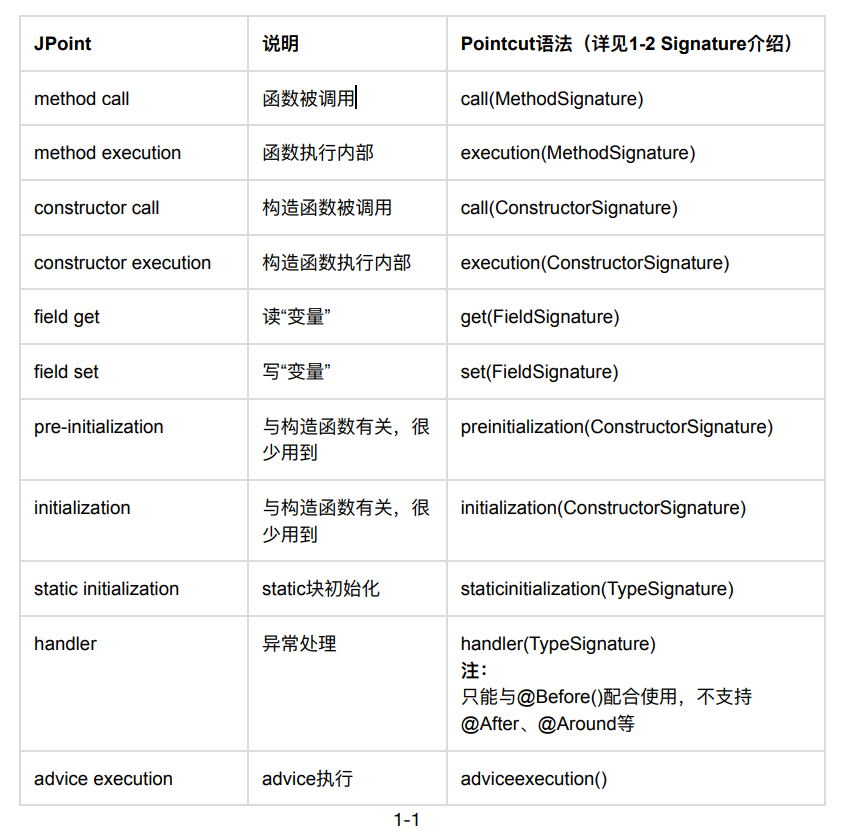
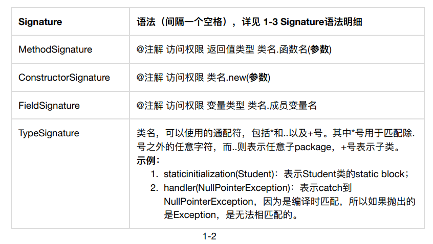
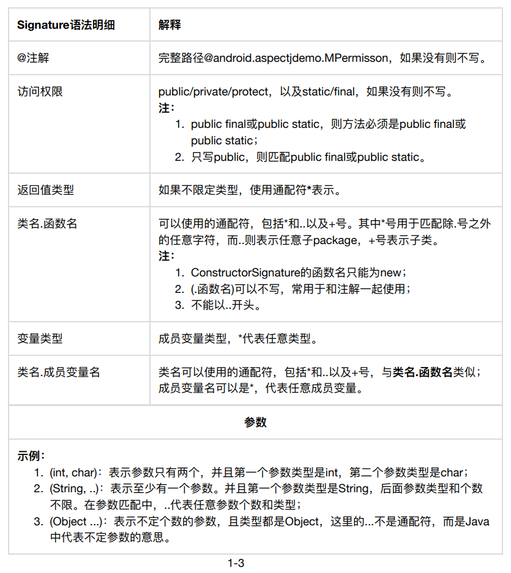
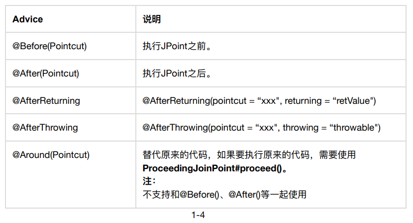
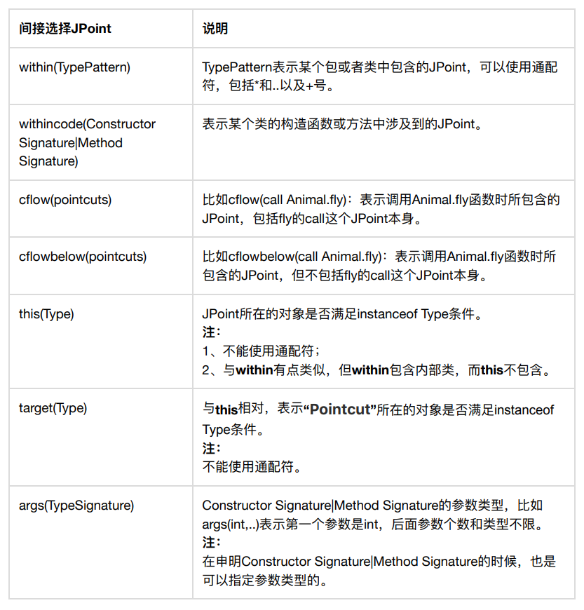

## AOP

> AOP : Aspect Oriented Programming 的缩写，意为：面向切面编程

优点：针对同一问题的统一处理；无侵入添加代码

Android 平台，常用的是 hujiang 的一个[aspectjx插件](https://github.com/HujiangTechnology/gradle_plugin_android_aspectjx)，它的工作原理是：通过Gradle Transform，在class文件生成后至dex文件生成前，遍历并匹配所有符合AspectJ文件中声明的切点，然后将事先声明好的代码在切点前后织入。


整个过程发生在编译期，是一种静态织入方式，所以会增加一定的编译时长，但几乎不会影响程序的运行时效率。

## AspectJ 能做什么

针对同一问题的统一处理，实际场景比如：

- 统计埋点
- 日志打印/打点
- 数据校验
- 行为拦截
- 性能监控
- 动态权限控制

## AspectJ 几个术语

- JPoint：代码可注入的点，比如一个方法的调用处或者方法内部、“读、写”变量等。
- Pointcut：一个程序有很多JPoint，Pointcut的目的就是提供一种方法使得开发者能够选择自己感兴趣的JPoint。
- Advice：指定注入的代码在 Pointcut 何处注入。常见的有 Before、After、Around 等，表示代码执行前、执行后、替换目标代码。
- Aspect：用它声明一个类，表示一个需要执行的切面。

## AspectJ 配置

项目根目录的build.gradle添加

```groovy
buildscript {
    ...
    dependencies {
        ...
        classpath 'com.hujiang.aspectjx:gradle-android-plugin-aspectjx:2.0.0'
    }
}
```

app项目的build.gradle新建的module的build.gradle里添加

```groovy
apply plugin: 'android-aspectjx'

dependencies {
    ...
    api 'org.aspectj:aspectjrt:1.9.5'
}
```

常用实例：https://github.com/zywudev/AspectJDemo

## Aspect 语法

由于语法内容较多，实际使用过程中我们可以参考[语法手册](https://github.com/hiphonezhu/Android-Demos/blob/master/AspectJDemo/AspectJ.pdf)。







## 参考文章

[Android AspectJ详解](https://juejin.im/post/5d7a049af265da03d1557f42)

[AOP 之 AspectJ 全面剖析 in Android](https://www.jianshu.com/p/f90e04bcb326)


