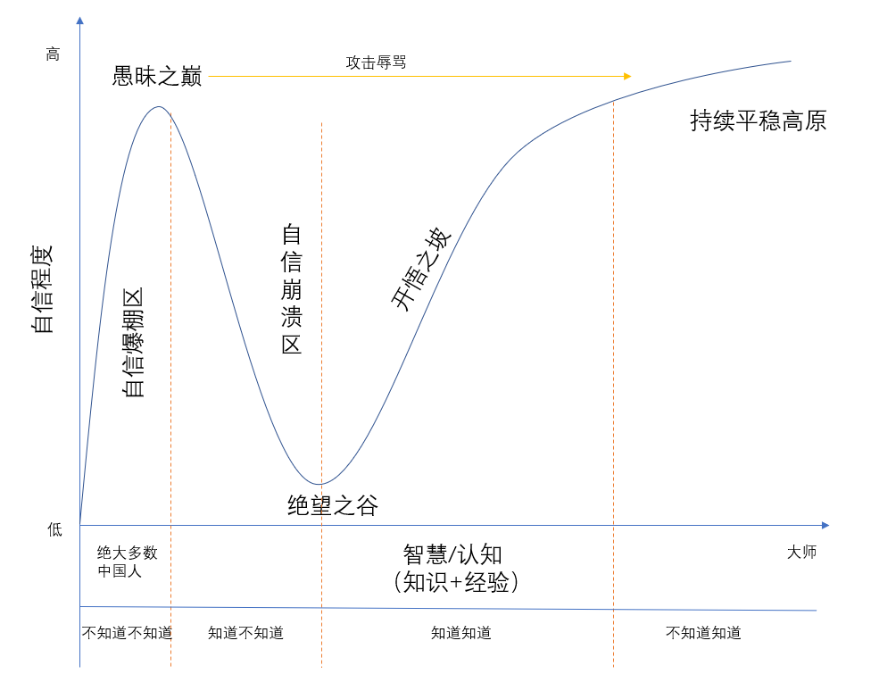

>**达克效应**（英语：D-K effect），全称为**邓宁-克鲁格效应**（英语：Dunning–Kruger effect），是一种[认知偏差](https://zh.wikipedia.org/wiki/%E8%AE%A4%E7%9F%A5%E5%81%8F%E5%B7%AE)，能力欠缺的人有一种虚幻的自我优越感，错误地认为自己比真实情况更加优秀。简言之即：庸人容易因欠缺自知之明而自我膨胀。
>
>[Kruger](https://zh.wikipedia.org/w/index.php?title=Kruger&action=edit&redlink=1)和[Dunning](https://zh.wikipedia.org/w/index.php?title=Dunning&action=edit&redlink=1)将其归咎于[元认知](https://zh.wikipedia.org/wiki/%E5%85%83%E8%AE%A4%E7%9F%A5)上的缺陷，能力欠缺的人无法认识到自身的无能，不能准确评估自身的能力。他们的研究还表明，反之，非常能干的人会低估自己的能力，错误地假定他们自己能够很容易完成的任务，别人也能够很容易地完成。

参考网上，动手绘制了下面这张图，更为清晰。

从左往右，智慧从低到高，从下往上，是自信程度从低到高。

不是所有人都能完整的经历这条曲线。

大多数人都是在攀爬愚昧山峰，到顶之后可能就不动了。不动的原因是什么 ？**认知停滞**。认知停滞，会导致个人对世界的看法难以发生改变。对待新事物，只会用自己的思维框架强行套用，自信心爆棚，根本没有耐心去了解未知的领域。

当掌握的领域知识越来越多，认知逐渐提高后，一些人会进入「自信崩溃区」，因为这个时候知道了自己未知的领域太多太多，自信心备受打击，不知道如何是好。

到达「绝望之谷」后不一定马上就能反弹，有时需要经历很多波折，才能对新的领域有正确的认识，而新的开悟之坡非常漫长，有些人终其一生都不能进入「平稳高原」。

人与人之间的差异，真的是认知的差异。

身处「愚昧之巅」的人，更有倾向会去攻击辱骂更加智慧的人。主要原因就是认知差距，无知无畏。

认知层次高的人，对未知领域会更有敬畏心。

这张图值得时不时拿出来看看，就某件事情，对号入座，反思，避免成为达克效应描述的对象。

