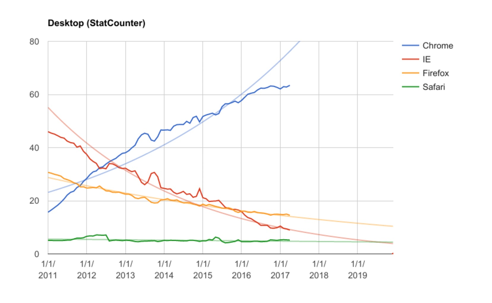
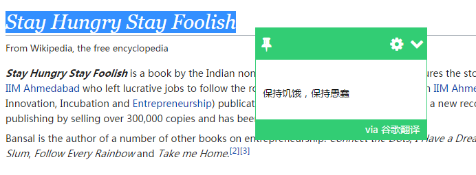
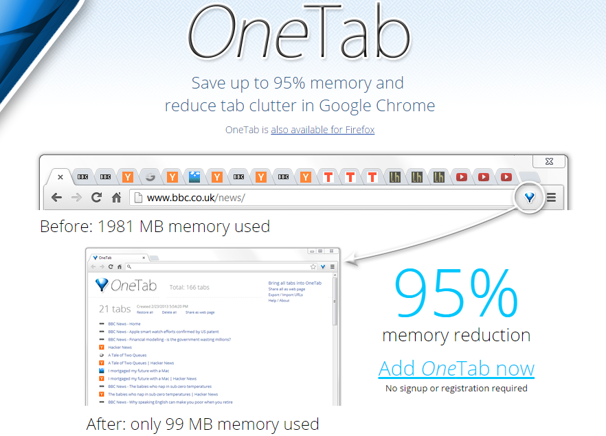
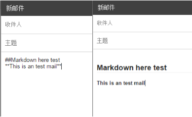
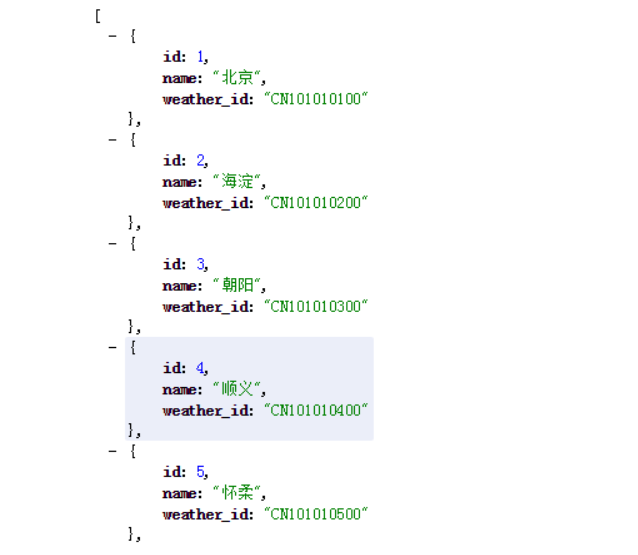
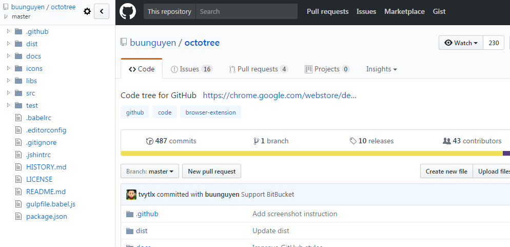
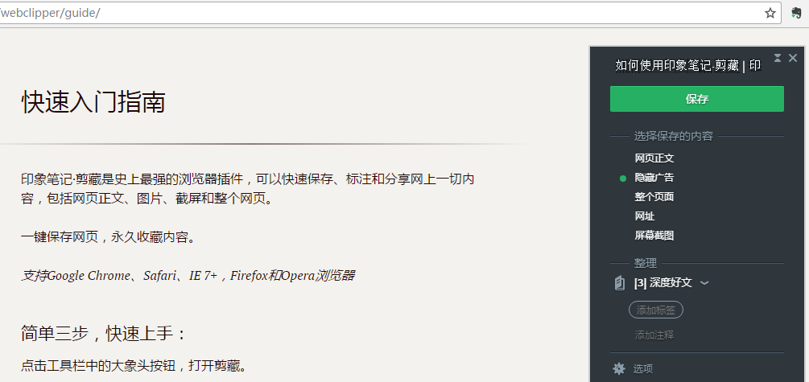

近些年来，在众多浏览器大战中，Google 的 Chrome 浏览器的市场份额位居首位，而且依然呈现高速增长趋势。Chrome 浏览器的优点不必多言，谁用谁知道。

这里主要推荐本人常用的 Chrome 插件，能够帮助你更加便捷高效的使用 Chrome 浏览器。

1、[Checker Plus for Gmail™](https://jasonsavard.com/zh-CN/Checker-Plus-for-Gmail)

这个插件的强大之处在于你无需打开 Gmail ，即可收到桌面邮件通知，方便地查看、撰写或删除邮件。

2、[划词翻译](https://github.com/Selection-Translator/crx-selection-translate)

支持谷歌、百度、有道、必应四大翻译和朗读引擎，可以方便的查看、复制和朗读不同引擎的翻译结果。再也不用担心读不懂英文资料了。

3、[OneTab](https://www.one-tab.com/)

在 chrome 打开了很多窗口时，内存消耗大，对于配置较低的电脑可能会卡顿，但很多 tab 可能会用到，又不舍得关掉。这个时候你只需要点击 OneTab，就可以直接将所有 tab 回收，稍后重新打开 chrome 都能找到历史记录。

4、[Markdown Here](http://markdown-here.com/)

对于习惯使用 markdown 的人群来说，markdown 可能是写作的唯一方式。使用 Markdown Here 插件可以让你在 Gmail 中使用 markdown，让你写一封排版漂亮的电子邮件。不仅如此，Markdown Here 还支持 Evernote 和微信公众号。只需要在富文本区域按照 markdown 语法编辑，点击 Markdown Here图标进行转换，或者右键菜单进行 markdown 转换。当然能转换过去也能再转换回来继续编辑。

5、[JSONView](https://chrome.google.com/webstore/detail/jsonview/chklaanhfefbnpoihckbnefhakgolnmc)

通过 Chrome 查看服务器返回的 Json 格式的内容时，基本全是乱的。使用这个插件的好处是它自动排列出 Json 数据，可以很直观的查看数据格式，可谓开发者必备插件。

6、[Octotree](https://github.com/buunguyen/octotree)

这个插件能够直接在 Chrome 侧边栏查看 Github 项目文件夹，很方便、很实用。

7、[Save to Pocket](https://chrome.google.com/webstore/detail/save-to-pocket/niloccemoadcdkdjlinkgdfekeahmflj)

Pocket 是一款稍后读软件，当你在浏览博客或者比较好的文章等，如果当时没有精力消化完，可以用这个插件保存到 Pocket 中，手机上的 Pocket 客户端会实时同步，你可以利用碎片化时间消化保存的知识。而且 Pocket 的阅读排版非常美观大方。

8、[印象笔记·剪藏](https://chrome.google.com/webstore/detail/evernote-web-clipper/pioclpoplcdbaefihamjohnefbikjilc)

最后，推荐「印象笔记·剪藏」。如果你使用印象笔记来记录笔记，肯定离不了这个插件，一键保存网页到印象笔记，即时同步到你的手机和电脑，不用复制粘贴编辑再整理。

这八个是我一直都在使用的插件，推荐给需要的看官。当然啦，Chrome 插件太多了，如果你有觉得不错的插件也可以推荐给我。

