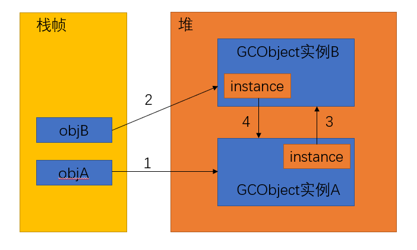
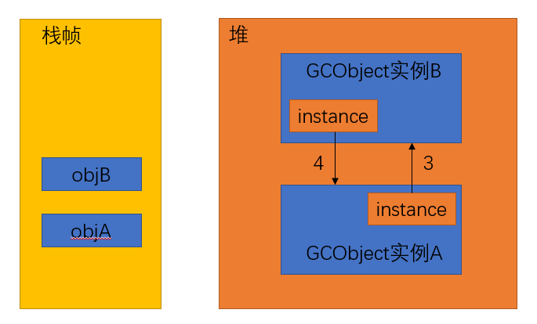

JVM 的垃圾回收器主要关注的是堆上创建的实例对象，在每次对这些对象进行回收前，需要确定哪些对象是可以去进行回收的。

主要有下面两种方法。

## 引用计数算法

给对象添加一个引用计数器，当有一个地方引用它，计数器值加 1；当引用失效时，计数器值减 1。任何时刻计数器值为 0 表示这个对象可以被回收了。

**优点**：

判断效率高，实现简单。

**不足之处**：

难以解决对象之间相互循环引用的问题。

比如：

```java
public class GCDemo {
     
    public static void main(String[] args) {
        GCObject objA = new GCObject();  // step 1
        GCObject objB = new GCObject();  // step 2
        
        objA.instance = objB;  // step 3
        objB.instance = objA;  // step 4
        
        objA = null;  // step 5
        objB = null;  // step 6
        
        System.gc();   // 执行 GC
    }
}

class GCObject {
    public Object instance = null;
}
```

堆栈结构如下图：



`main` 方法中执行的 6 个步骤对应的引用计数结果：

step 1、实例A 引用计数加 1，引用计数 = 1；

step 2、实例B 引用计数加 1，引用计数 = 1；

step 3、实例B 引用计数加 1，引用计数 = 2；

step 4、实例A引用计数加 1，引用计数 = 2；

step 5、objA 引用不再指向实例 A，实例 A 的引用计数减为 1；

step 6、objB 引用计数不再指向实例 B，实例B的引用计数减为 1。

到此，GCObject 的实例 A 和 实例 B 的引用计数都不为 0， 此时如果执行垃圾回收，实例 A 和实例 B 是不会被回收的，也就出现内存泄漏了。

上述代码中，假设在 `main` 方法的最后执行 GC 操作，GC 日志如下：

```java
[GC (System.gc()) [PSYoungGen: 2668K->776K(38400K)] 2668K->784K(125952K), 0.0095289 secs] [Times: user=0.00 sys=0.00, real=0.02 secs] 
[Full GC (System.gc()) [PSYoungGen: 776K->0K(38400K)] [ParOldGen: 8K->624K(87552K)] 784K->624K(125952K), [Metaspace: 3395K->3395K(1056768K)], 0.0057008 secs] [Times: user=0.08 sys=0.00, real=0.00 secs] 
Heap
 PSYoungGen      total 38400K, used 998K [0x00000000d5f80000, 0x00000000d8a00000, 0x0000000100000000)
  eden space 33280K, 3% used [0x00000000d5f80000,0x00000000d6079b20,0x00000000d8000000)
  from space 5120K, 0% used [0x00000000d8000000,0x00000000d8000000,0x00000000d8500000)
  to   space 5120K, 0% used [0x00000000d8500000,0x00000000d8500000,0x00000000d8a00000)
 ParOldGen       total 87552K, used 624K [0x0000000081e00000, 0x0000000087380000, 0x00000000d5f80000)
  object space 87552K, 0% used [0x0000000081e00000,0x0000000081e9c068,0x0000000087380000)
 Metaspace       used 3415K, capacity 4496K, committed 4864K, reserved 1056768K
  class space    used 371K, capacity 388K, committed 512K, reserved 1048576K
```

实例 A、实例 B 都被放在新生代， `Full GC` 表示垃圾收集发生了 `Stop-The-World   `。所以直接看这一行，`[PSYoungGen: 776K->0K(38400K)]` ，JVM 并没有因为实例 A 和 实例 B 相互引用就没有去回收它们。表明了 JVM 并没有采用引用计数算法判定对象是否可以被回收。

JVM 中采用的是可达性分析算法判断对象是否可以被回收的。

## 可达性分析算法

基本思路：

通过一系列称为 "GC Roots" 的对象作为起始点，从这个节点向下搜索，搜索走过的路径就是引用链，当一个对象到 GC Roots 没有任何引用链相连，也就是从 GC Roots 到这个对象不可达，则这个对象不可达，可以被回收。

**可作为 GC Roots 的对象有**：

- 虚拟机栈中的引用的对象
- 方法区的静态变量和常量引用的对象
- 本地方法栈中 JNI 引用的对象

在上面的例子中，当执行第 5、6 步后，内存堆栈结构如下图。虽然实例 A 和实例 B 相互引用，但是它们到 GC Roots 都是不可达的了，所以它们都会被判定成可回收对象。



## 参考

[深入理解Java虚拟机:JVM高级特性与最佳实践(第2版)](https://book.douban.com/subject/24722612/)

