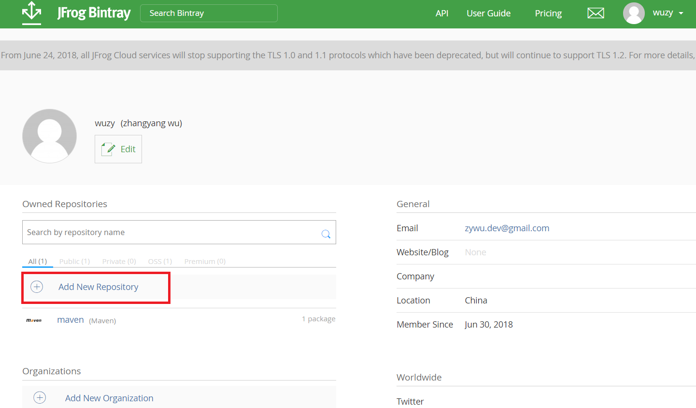
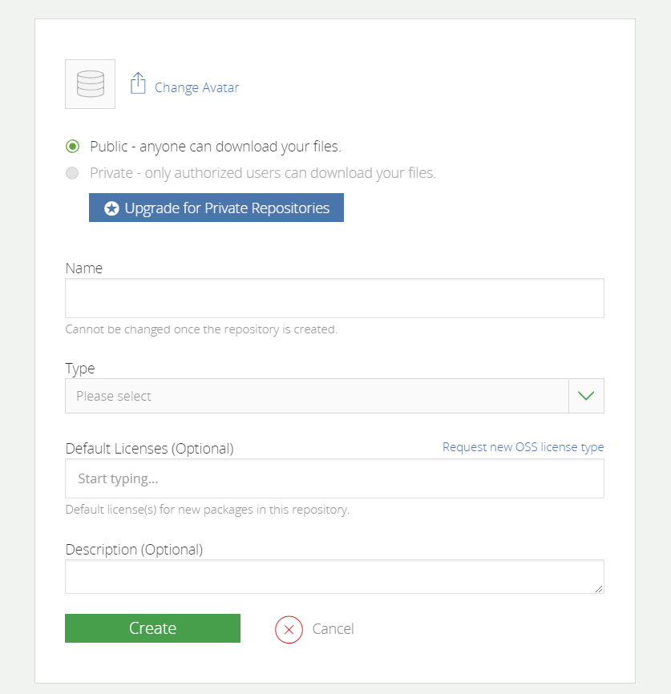
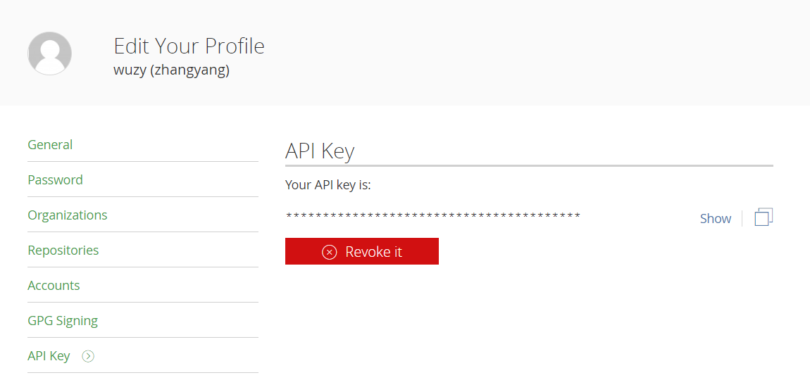
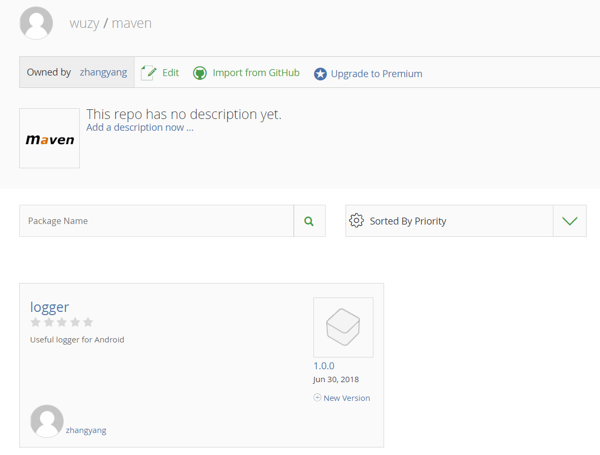
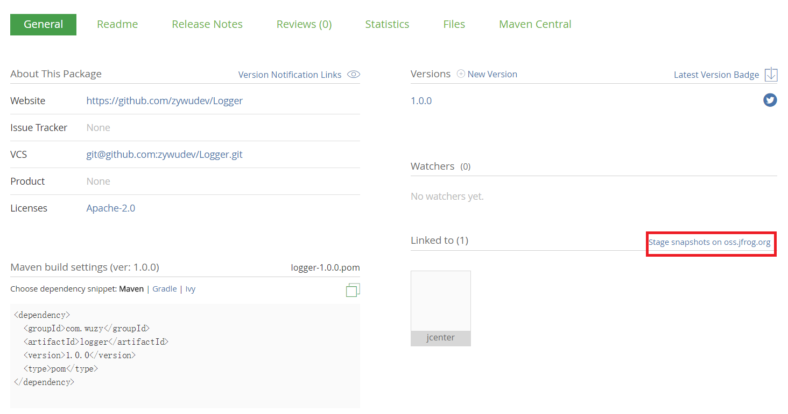

前几天上传了个项目至 Jcenter，看了网上很多教程，基本都是以 `gradle-bintray-plugin ` 这个插件做上传，教程看着都好费劲，对于新手来说真的好麻烦。

找到了另外一种方法，采用 `bintray-release` 插件，感觉要比 `gradle-bintray-plugin ` 简单很多啊。于是在此记录一下，希望能帮助到新手。

### 1、注册 bintray.com 账户

jcenter 是属于 bintray 的一个仓库，所以需要注册账户。注意默认注册的是组织，个人账户注册地址是 `https://bintray.com/signup/oss` ，可以用 GitHub、Google 账户注册。

### 2、创建私有maven仓库

点击下图中的 `Add New Repository` 。



出现下图的界面，**注意其中的 Name 和 Type 都要写成 maven**。



### 3、引入 bintray-release

在项目的 build.gradle 添加 `bintray-release` 的 classpath，注意是项目的 build.gradle，不是module 的。

```java
buildscript {
    
    repositories {
        google()
        jcenter()
    }
    dependencies {
        classpath 'com.android.tools.build:gradle:3.1.0'
        classpath 'com.novoda:bintray-release:0.8.1'

        // NOTE: Do not place your application dependencies here; they belong
        // in the individual module build.gradle files
    }
}
```

在待上传 moudle 的 build.gralde 中添加

```java
apply plugin: 'com.android.library'
apply plugin: 'com.novoda.bintray-release'  // 新增
android {
    compileSdkVersion 27
    defaultConfig {
        // 保持不变
    }

    buildTypes {
        // 保持不变
    }
}

dependencies {
   // 保持不变
}

// 新增
publish {
    userOrg = 'wuzy'        //bintray.com用户名
    groupId = 'com.wuzy'    //jcenter上的路径
    artifactId = 'logger'   //项目名称
    publishVersion = '1.0.0'//版本号
    desc = 'desc'//描述，自由填写
    website = 'https://github.com/zywudev/Logger' // 网址，自由填写
}
```

按照上述的编写，最终引入的方式为：`compile 'com.wuzy:logger:1.0.0` 。

### 4、上传

上传很简单，在 Android Studio 或 cmd 控制台运行一下命令，看到 BUILD SUCCESS 即上传成功。

```java
gradlew clean build bintrayUpload -PbintrayUser=username -PbintrayKey=xxxxxxxxxxxxx -PdryRun=false
```

其中 PbintrayUser 为用户名，PbintrayKey 是个人的 API Key，可在 bintray 网站上点击 Edit Profile，即可看到。



上传成功后，访问 `https://bintray.com/用户名/maven`，即可看到上传的项目。



注意此时还不能直接引用，因为项目还未添加到 Jcenter 仓库中。在下图的红色区域，未手动添加到 Jcenter 的会出现 `Add to Jcenter` 按钮，点击 `Add to Jcenter` 加入 `commit` 信息就行了，一般需要等待审核通过，几个小时吧，添加成功后`Add to Jcenter`那个按钮就消失了，如下图。



同样，可以在 jcenter 仓库中可以看到自己的项目了。


至此，整个流程就结束了，是不是很简单。