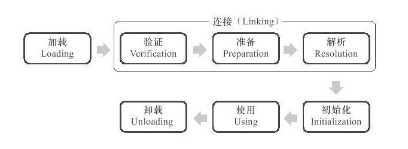
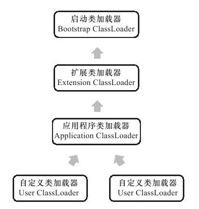

## 类的生命周期

包含七个阶段：

加载、验证、准备、解析、初始化、使用、卸载。

- 验证、准备、解析三个阶段统称为连接。

- 加载、验证、准备、初始化和卸载的顺序是确定的，解析和初始化的前后顺序不一定，主要是为了实现动态绑定。

## 类加载过程
类加载过程主要包含加载、验证、准备、解析和初始化这 5 个阶段。

### 加载
加载是类加载的第一个阶段，注意不要混淆。

加载过程要完成的三件事情：

- 通过一个类的全限定名来获取定义此类的二进制字节流。
- 将这个字节流所代表的静态存储结构转化为方法区的运行时数据结构。
- 在内存中生成一个代表这个类的 java.lang.Class 对象，作为方法区这个类的各种数据的访问入口。

其中二进制字节流可以从以下方式获取：

- 从 ZIP 包读取，称为 JAR、EAR、WAR 格式的基础。
- 从网络获取，最典型的应用是 Applet。
- 运行时计算，例如动态代理技术，在 java.lang.reflect.Proxy 使用 ProxyGenerator.generateProxyClass 的代理类的二进制字节流。
- 由其他文件生成，典型场景是JSP应用，即由JSP文件生成对应的 Class 类。

### 验证

验证的目的是为了确保 Class 文件的字节流中包含的信息符合当前虚拟机的要求，并且不会危害虚拟机自身的安全。

验证阶段主要完成四个阶段的校验动作：

- 文件格式验证。验证字节流是否符合 Class 文件格式的规范，并且能被当前版本的虚拟机处理。
- 元数据验证。对字节码描述的信息进行语义分析，以保证其描述的信息符合 Java 语言规范的要求。
- 字节码验证。通过数据流和控制流分析，确定程序语义是合法的、符合逻辑的。
- 符号引用验证。主要是对类自身以外的信息（常量池中的各种符号引用）进行匹配性的校验。确保解析动作能正常执行。

### 准备

为类变量分配内存并设置类变量初始值的阶段。类变量是指被 `static` 修饰的变量。

 这里的初始值一般是数据类型的零值。比如：

 ```java
public static int value = 123;
 ```
变量 value 在准备阶段的初始值是 0 而不是 123。

如果类变量是常量，初始值是所定义的值而不是零值。例如下面的常量 value 被初始化为 123 而不是 0。

 ```java
public static final int value = 123;
 ```
### 解析
将常量池的符号引用替换为直接引用的过程。

其中解析过程在某些情况下可以在初始化阶段之后再开始，这是为了支持 Java 的动态绑定。

- 符号引用：符号引用就是字符串，这个字符串包含足量的信息，以供实际使用时可以找到相应的位置。
- 直接引用：直接引用就是偏移量，通过便宜量虚拟机可以直接在该类的内存区域中找到方法字节码的起始位置。

### 初始化
初始化是类加载过程中的最后一步，这个阶段才真正开始执行类中定义的 Java 程序代码。

初始化阶段是虚拟机执行类构造器 `<clinit>() `方法的过程。

在准备阶段，已经为类变量分配了系统所需的初始值，并且在初始化阶段，根据程序员通过程序进行的主观计划来初始化类变量和其他资源。`<clinit>()` 是由编译器自动收集类中所有类变量的赋值动作和静态语句块中的语句合并产生的，编译器收集的顺序由语句在源文件中出现的顺序决定。特别注意的是，静态语句块只能访问到定义在它之前的类变量，定义在它之后的类变量只能赋值，不能访问。例如以下代码：
```java
public class Test {
    static {
        i = 0;                // 给变量赋值可以正常编译通过
        System.out.print(i);  // 这句编译器会提示“非法向前引用”
    }
    static int i = 1;
}
```
由于父类的 `<clinit>()` 方法先执行，也就意味着父类中定义的静态语句块的执行要优先于子类。例如以下代码：
```java
static class Parent {
    public static int A = 1;
    static {
        A = 2;
    }
}

static class Sub extends Parent {
    public static int B = A;
}

public static void main(String[] args) {
     System.out.println(Sub.B);  // 2
}
```
接口中不可以使用静态语句块，但仍然有类变量初始化的赋值操作，因此接口与类一样都会生成 `<clinit>()` 方法。但接口与类不同的是，执行接口的 `<clinit>()` 方法不需要先执行父接口的 `<clinit>()` 方法。只有当父接口中定义的变量使用时，父接口才会初始化。另外，接口的实现类在初始化时也一样不会执行接口的 `<clinit>()` 方法。

虚拟机会保证一个类的 `<clinit>()` 方法在多线程环境下被正确的加锁和同步，如果多个线程同时初始化一个类，只会有一个线程执行这个类的 `<clinit>()` 方法，其它线程都会阻塞等待，直到活动线程执行 `<clinit>()` 方法完毕。如果在一个类的 `<clinit>()` 方法中有耗时的操作，就可能造成多个线程阻塞，在实际过程中此种阻塞很隐蔽。
## 类加载器
两个类相等，需要类本身相等，并且使用同一个类加载器进行加载。这是因为每一个类加载器都拥有一个独立的类名称空间。

这里的相等，包括类的 Class 对象的 `equals()` 方法、`isAssignableFrom()` 方法、`isInstance()` 方法的返回结果为 true，也包括使用 `instanceof` 关键字做对象所属关系判定结果为 true。

### 类加载器分类
从 Java 虚拟角度，只存在两种不同的类加载器：
- 启动型类加载器（Bootstrap ClassLoader），C++ 语言实现，是虚拟机自身的一部分。
- 其他的类加载器：Java 语言实现，独立于虚拟机外部，全部继承自抽象类 java.lang.ClassLoader。

从 Java 开发人员的角度，类加载器大致分为以下三类：
- 启动类加载器：Bootstrap ClassLoader，跟上面相同。它负责加载存放在 JDK\jre\lib 下，或被 -Xbootclasspath 参数指定的路径中的，并且能被虚拟机识别的类库（如rt.jar，所有的 java.* 开头的类均被 Bootstrap ClassLoader 加载）。启动类加载器是无法被 Java 程序直接引用的。

- 扩展类加载器：Extension ClassLoader，该加载器由 sun.misc.Launcher$ExtClassLoader 实现，它负责加载 JDK\jre\lib\ext 目录中，或者由 java.ext.dirs 系统变量指定的路径中的所有类库（如 javax.* 开头的类），开发者可以直接使用扩展类加载器。
- 应用程序类加载器：Application ClassLoader，该类加载器由 sun.misc.Launcher$AppClassLoader 来实现，它负责加载用户类路径（ClassPath）所指定的类，开发者可以直接使用该类加载器，如果应用程序中没有自定义过自己的类加载器，一般情况下这个就是程序中默认的类加载器。

### 双亲委托模型

应用程序是由三种类加载器互相配合从而实现类加载，除此之外还可以加入自己定义的类加载器。

下图展示了类加载器之间的层次关系，称为双亲委派模型（Parents Delegation Model）。该模型要求除了顶层的启动类加载器外，其它的类加载器都要有自己的父类加载器。类加载器之间的父子关系一般通过组合关系（Composition）来实现，而不是继承关系（Inheritance）。


#### 工作过程
一个类加载器首先将类加载请求转发到父类加载器，只有当父类加载器无法完成时才尝试自己加载。
#### 好处
使得 Java 类随着它的类加载器一起具有一种带有优先级的层次关系，从而使得基础类得到统一。

例如 java.lang.Object 存放在 rt.jar 中，如果编写另外一个 java.lang.Object 并放到 ClassPath 中，程序可以编译通过。由于双亲委派模型的存在，所以在 rt.jar 中的 Object 比在 ClassPath 中的 Object 优先级更高，这是因为 rt.jar 中的 Object 使用的是启动类加载器，而 ClassPath 中的 Object 使用的是应用程序类加载器。rt.jar 中的 Object 优先级更高，那么程序中所有的 Object 都是这个 Object。

#### 实现方式
实现双亲委派的代码都集中在java.lang.ClassLoader的 `loadClass()` 方法之中。

先检查是否已经被加载过，若没有加载则调用父加载器的 `loadClass()` 方法，若父加载器为空则默认使用启动类加载器作为父加载器。如果父类加载失败，抛出ClassNotFoundException异常后，再调用自己的 `findClass()` 方法进行加载。
### 自定义 ClassLoader

继承 java.lang.ClassLoader 类，重写 `findClass` 方法。比如：

```java
public class FileSystemClassLoader extends ClassLoader {

    private String rootDir;

    public FileSystemClassLoader(String rootDir) {
        this.rootDir = rootDir;
    }

    protected Class<?> findClass(String name) throws ClassNotFoundException {
        byte[] classData = getClassData(name);
        if (classData == null) {
            throw new ClassNotFoundException();
        } else {
            return defineClass(name, classData, 0, classData.length);
        }
    }

    private byte[] getClassData(String className) {
        String path = classNameToPath(className);
        try {
            InputStream ins = new FileInputStream(path);
            ByteArrayOutputStream baos = new ByteArrayOutputStream();
            int bufferSize = 4096;
            byte[] buffer = new byte[bufferSize];
            int bytesNumRead;
            while ((bytesNumRead = ins.read(buffer)) != -1) {
                baos.write(buffer, 0, bytesNumRead);
            }
            return baos.toByteArray();
        } catch (IOException e) {
            e.printStackTrace();
        }
        return null;
    }

    private String classNameToPath(String className) {
        return rootDir + File.separatorChar
                + className.replace('.', File.separatorChar) + ".class";
    }
}
```

## 参考

- [深入理解Java虚拟机:JVM高级特性与最佳实践(第2版)](https://book.douban.com/subject/24722612/)

- [Java 虚拟机](https://github.com/CyC2018/CS-Notes/blob/master/docs/notes/Java%20%E8%99%9A%E6%8B%9F%E6%9C%BA.md#%E8%87%AA%E5%AE%9A%E4%B9%89%E7%B1%BB%E5%8A%A0%E8%BD%BD%E5%99%A8%E5%AE%9E%E7%8E%B0)

