很多程序员朋友都有在 GitHub Pages 上搭建自己的个人博客，对于个人博客，没有被搜索引擎收录的话，别人基本是是看不到的，再好的技术文无法被分享也是白搭。

基于 GitHub Pages 的个人博客， Google 收录非常及时全面。然而，到目前为止，GitHub 还是拒绝百度爬虫的访问，直接返回 403。

官方给出原因是，百度爬虫爬得太狠，影响了 Github Pages 服务的正常使用。这就导致了，但凡在 Github Pages 搭建的个人博客，都无法被百度收录。

## 现有的解决办法

1、使用 coding.net 建立镜像网站

我之前使用过 coding.net，在本地 repo 的配置文件中同时添加 GitHub 和 coding.net 远程 repo 地址，发布时，两边都会部署到，加上域名智能解析，对于国内的请求，转发到 Coding Page 即可。

但是通过 coding.net 访问个人主页时会先出现跳转页面，导致百度无法正确爬取。

2、利用 CDN

这个没试过，理论上来说，百度在第一次爬取时，CDN 上必须要已经有相应页面的缓存，否则，爬取的请求会被转发到 GitHub 源站，GitHub 还是会拒绝。

3、使用 Nginx 反向代理

Nginx 做反向代理，直接代理百度爬虫，去 GitHub Pages 请求，然后将结果返回给百度爬虫。

这种方式可行，只不过，这些方法都需要一定的定制能力，对于个人开发者，还得买一台 VPS 或者云服务器。

## 可靠、免费还简单的方法

Guillermo Rauch 大神创业搞了一个静态站 hosting 服务 [zeit.co](https://zeit.co/)，可以通过 GitHub Hooks 实现自动部署，zeit 提供 存储 + CDN  + DNS 一套完整的服务。

我给个人网站配置完成后，去百度站长试了一下，发现抓取成功了，sitemap 也提交成功了，坐等百度收录。

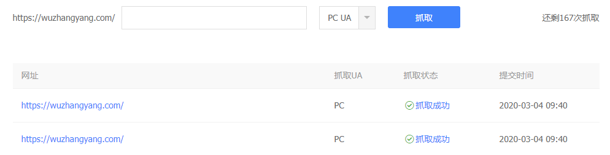

下面我把配置的步骤记录下来，给有需要的朋友一个参考。

zeit 网站主要就三个步骤：

- Github 账户登陆 zeit.io，授予 zeit repo 的 read 权限；

- 导入 GitHub 博客 repo；

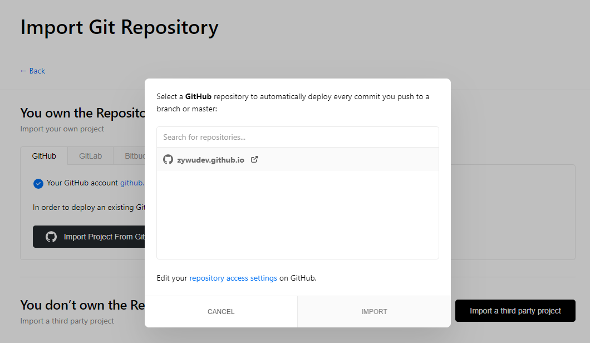

- 稍等片刻，部署成功。

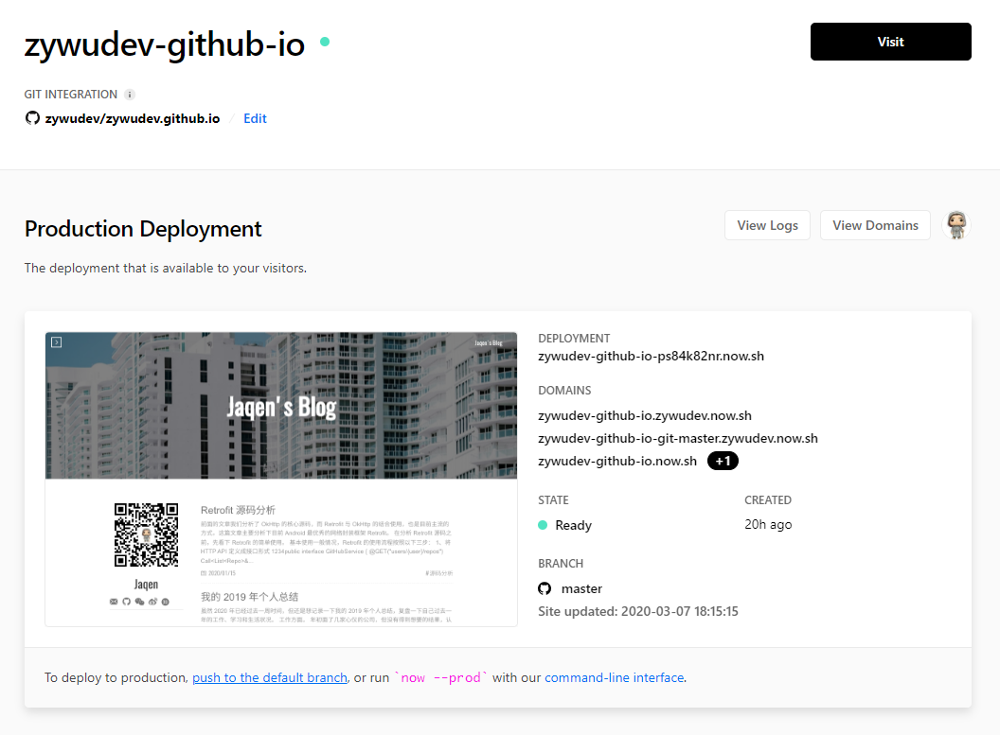

项目名中的 `.` 自动替换成 `-`，生成了一个类似于 `xxxx.now.sh` 的链接，点击可以访问你的博客主页，这时候静态资源已经部署到 zeit 的边缘 CDN 节点上了，下次你 GitHub 项目的任何更新会触发 zeit 项目更新。

接下来的就是切换域名，通过智能 DNS 将国内流量切过去。通过 zeit.io 提供的 DNS 解析服务配置自己的域名，然后在百度站长里配置信息。

在 Domains 下为项目添加你的个人域名。

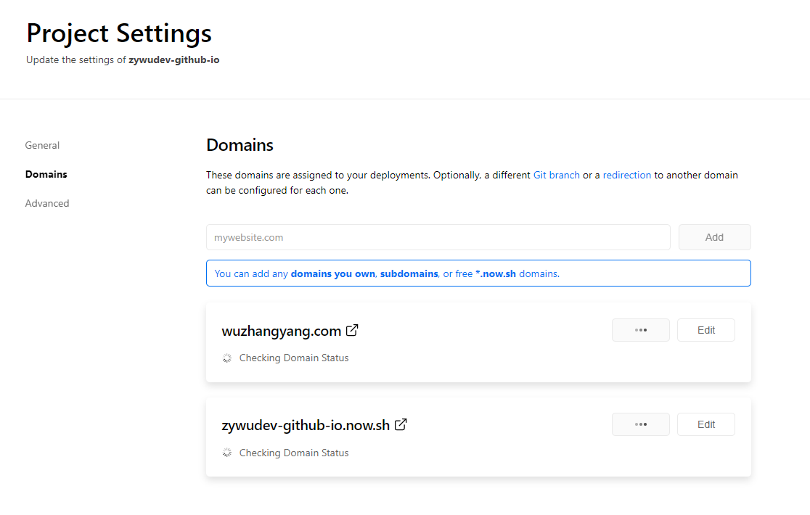

我添加后出现以下配置错误，原因我的域名权威 dns 是 dnspod。

一种解决方式是将直接使用 zeit 提供的 nameserver 智能 DNS，另一种方式，就是保留 dnspod 作为权威 dns 服务器，但是要添加一条 ANAME 记录。

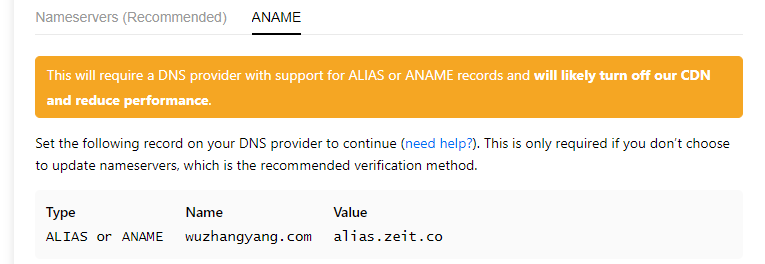

有两张配置方式，一种是改 nameserver，我用的是这种，权威dns服务器改成左边那些，我看到你还是用的dnspod来解析的。另一种方式，就是保留dnspod作为权威dns服务器，但是要添加一条ANAME记录。

我使用的是第一种方式，直接在阿里云替换了 DNS 服务器，直接用 zeit 提供的 nameserver 智能 DNS。

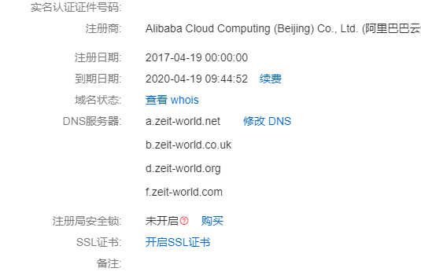

回到 zeit，刷新下，正常是这样，这里是给你签发 https 证书，免费的。

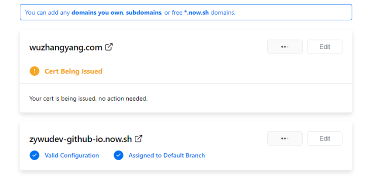

过一会儿应该就好了。

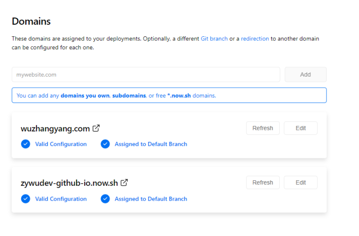

看一下 DNS 解析地址，说明 zeit 域名已经配置成功了。

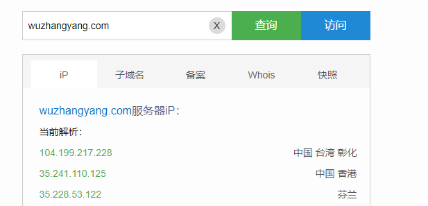

最后就是在百度站长里面添加个人域名了。这里注意选择 https 协议，因为 zeit 默认都是 https 了。

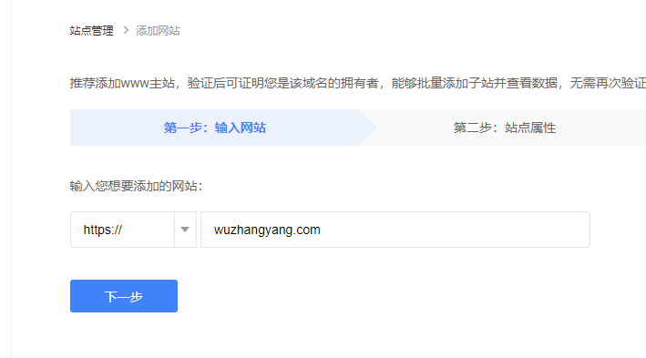

网站验证我采用的是文件验证，下载验证文件放在你博客本地 repo 的 source 目录下，部署到 GitHub，当然也会及时更新到 zeit。然后完成验证就好了，试一下链接诊断，看能不能正常抓取，失败的话，看看抓取的 ip 地址是不是还是之前的缓存，等待一段时间重新抓取下，时间取决于 dns 的 ttl。

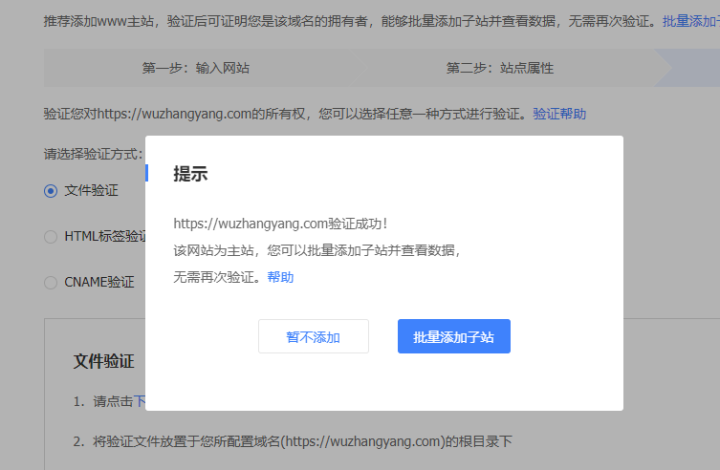

从[zeit.co](https://zeit.co/) 官网上看，台湾和香港都有 CDN 节点，免费账户可以有 20G/月，个人博客应该是够用了。

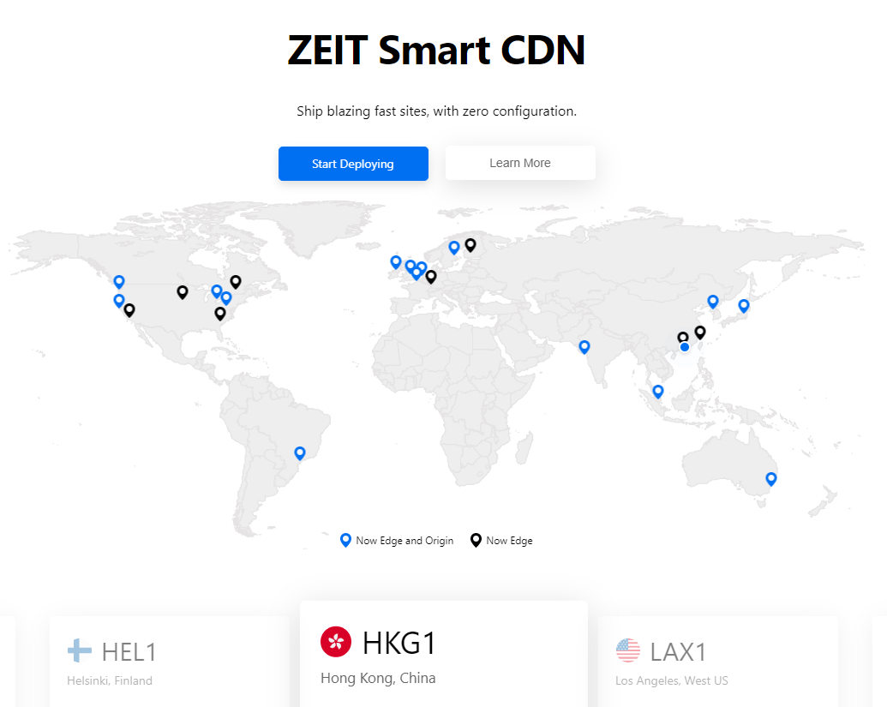

配置还是很简单的，赶紧试试吧，有问题欢迎交流。