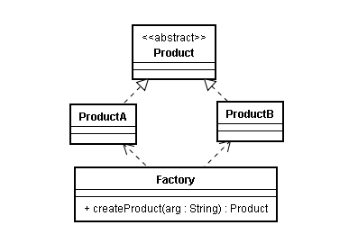
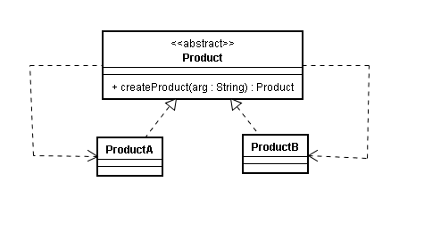

简单工厂模式将有关创建和初始化产品对象的工作搬到一个工厂类中，客户端只需要根据参数调用工厂类的静态方法即可使用工厂类创建的产品对象，无需承担对象的创建工作。这样做的好处就是将对象的创建和使用分离开来，能够防止用来实例化一个类的数据和代码在多个客户端类中到处都是，利于系统维护。

模型结构图如下：



其中包含以下几个角色：

- **Factory（工厂）**：负责实现创建所有产品实例的内在逻辑。提供了静态方法便于外界直接调用。
- **Product（抽象产品角色）**：工厂创建所有产品对象的父类，封装了所有产品对象的公有方法。
- **ConcreteProduct（具体产品角色）**：每一个具体的产品对象，需要继承抽象产品角色。

具体实现代码：

```java
// 抽象产品类
abstract class Product {
	// 所有产品类的公共业务方法
	public void methodSame() {
		// 实现
	}
	
	// 声明抽象业务方法
	public abstract void methodDiff();
}

// 具体产品类 ProductA
class ProductA extends Product {
	@Override
	public void methodDiff() {
	}
}
// 具体产品类 ProductB
class ProductB extends Product {
	@Override
	public void methodDiff() {	
	}
}

// 工厂类
class Factory {
	// 静态工厂方法
	public static Product createProduct(String arg) {
		Product product = null;
		if(arg.equalsIgnoreCase("A")) {
			product = new ProductA();
		} else if(arg.equalsIgnoreCase("B")) {
			product = new ProductB();
		}
		return product;
	}	
}

// 客户端测试代码
public class Client {

	public static void main(String[] args) {
		Product product;
		product = Factory.createProduct("A");  // 通过工厂类创建产品对象
		product.methodSame();
		product.methodDiff();
	}
}
```

有时，为了简化工厂模式，可以将抽象产品类和工厂类合并，将静态工厂方法移至抽象产品类。



**其主要缺点在于**：

- 工厂类集中了所有产品的创建逻辑，一旦不能正常工作，整个系统受到影响。
- 当引入新的产品，需要修改工厂类的源代码，违反了开闭原则。

适用场景：

- 产品对象较少，工厂方法的逻辑不会太复杂。
