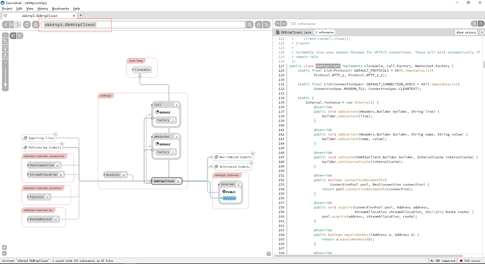
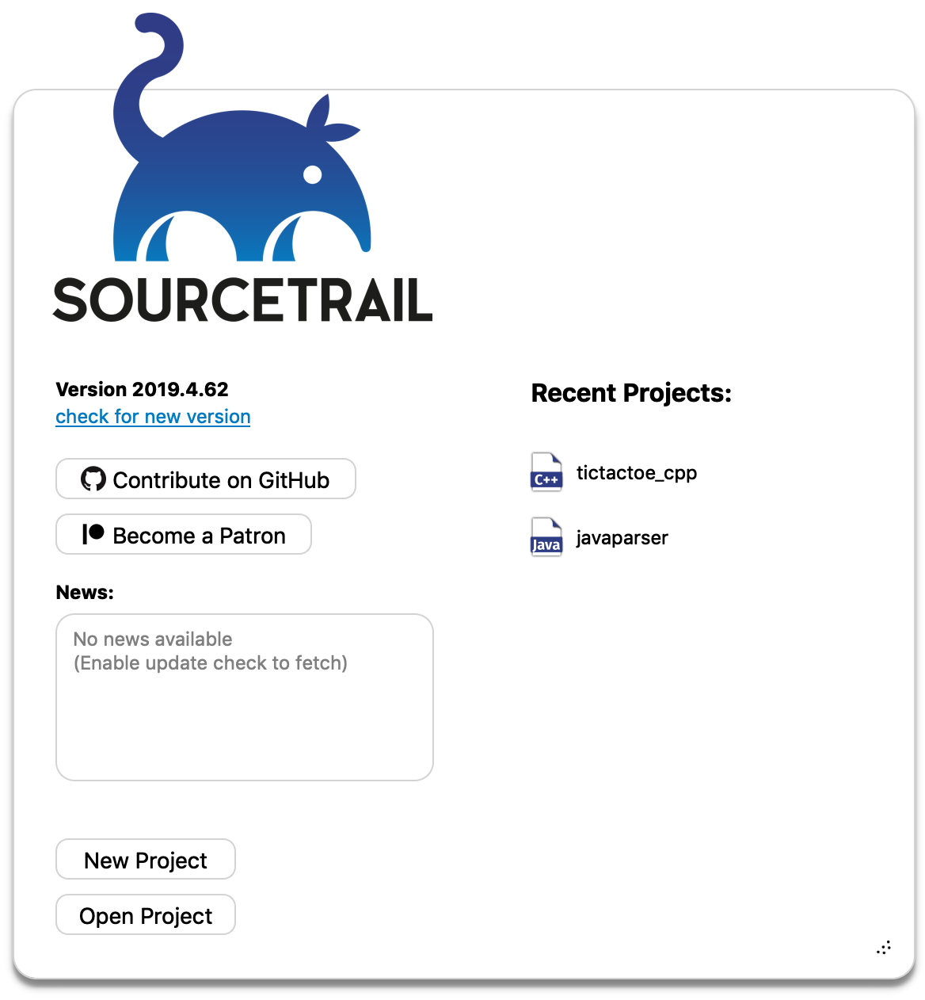
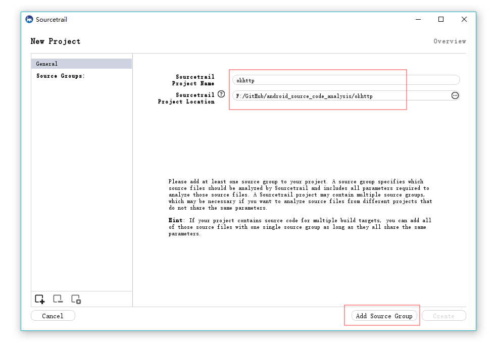
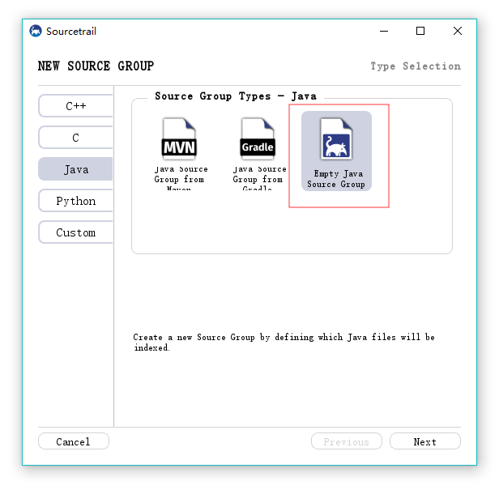
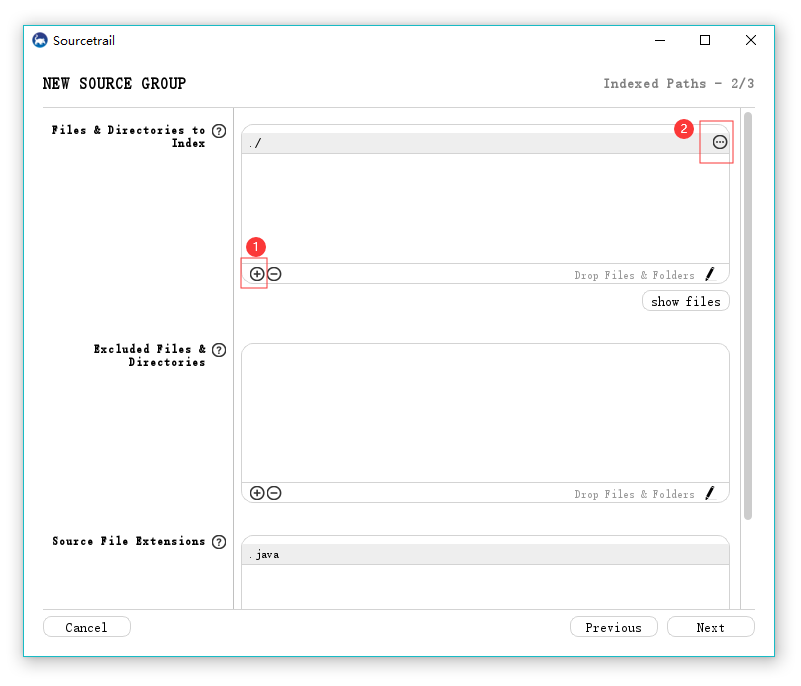
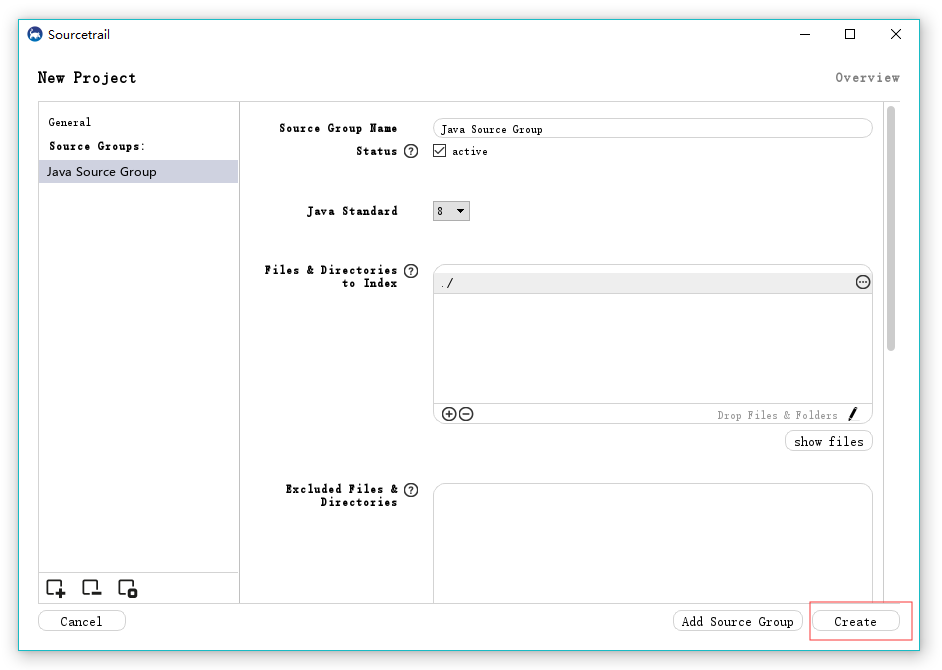
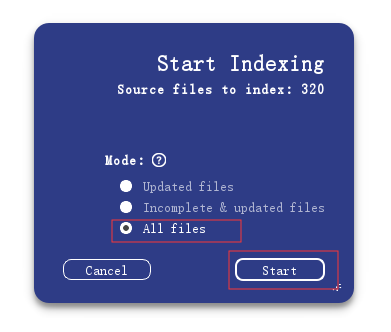
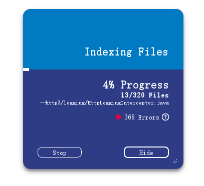
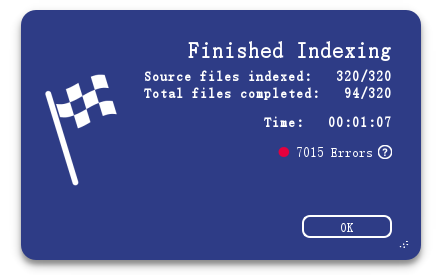
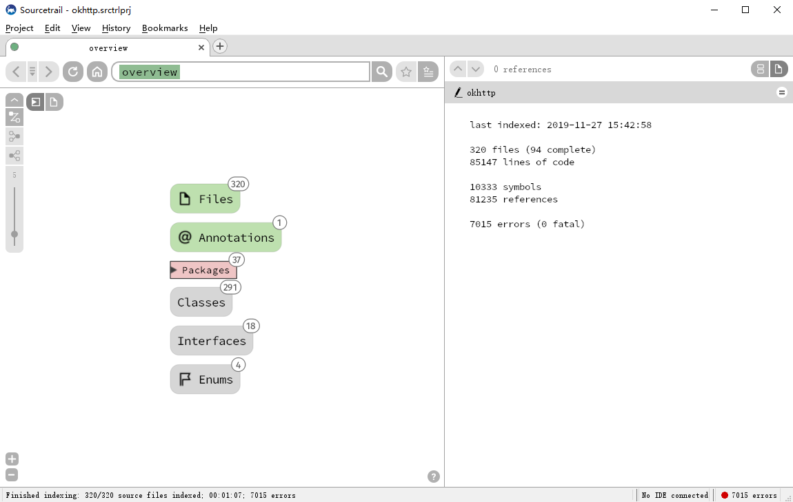

阅读源码的工具很多，今天给大家推荐一款别具一格的源码阅读神器。

它就是 Sourcetrail，一个免费开源、跨平台的可视化源码探索项目。

直接看效果图：

上面是我阅读 okhttp 源码的一个界面，不同于其他代码编辑器的导航栏，左侧使用图形直观地表示了调用上游和下游，类成员列表等等细节，使得理解源代码的结构变得很容易。

目前支持 C、C++、Python 和 Java 语言，同时提供了相关 SDK 用于拓展支持其它语言，相信在未来会提供更多语言的支持。

官网地址： 

https://www.sourcetrail.com/ 

目前已经开源：

https://github.com/CoatiSoftware/Sourcetrail 

支持 Windows、macOS、Linux 三个平台，下载地址：

https://github.com/CoatiSoftware/Sourcetrail/releases

下面简单介绍下如何使用 sourcetrail 阅读源码，以 okhttp 源码为例：

首先打开界面如下，点击左侧的 `New Project` 创建项目

选择预先下载好的 okhttp 源码文件夹

点击 `Add Source Group`，选择 Empty Java Source Group：

点击 `Next` 到下面这个界面， 依次点击步骤 1、2 指定索引文件： 

点击 `Next` 后出现下面的界面，点击 `Create` 按钮：

选择 `All Files`， 点击 `Start` 按钮开始索引，等待一段时间。

出现 Error 是正常的，因为源码中有很多文件找不到，不影响阅读源码。

索引完成后点击 `OK`，就可以开始源码阅读了。

项目中的符号都可以点击，支持来回跳转，还支持模糊搜索。左侧源码结构非常清晰，对于熟悉陌生代码结构非常有用。

还可以与其他编辑器链接，比如： Atom, Clion, Eclipse, Emacs, IntelliJ IDEA 等等。

还有更多功能可以参见官方文档：

 https://www.sourcetrail.com/documentation/ 

一般不特地推荐，一推荐必是利器。赶紧上手体验下。