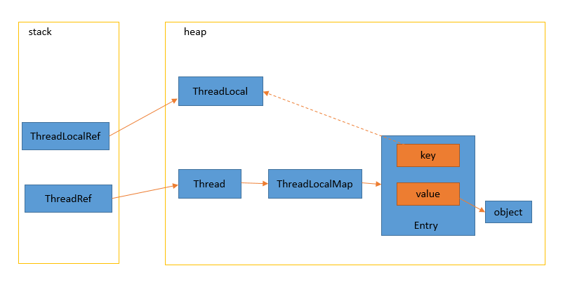

## ThreadLocal 是什么
ThreadLocal 提供了线程局部变量。它和普通变量的区别在于，普通变量可以被任何一个线程访问并修改，而使用 ThreadLocal 创建的变量只能被当前线程访问，也就是线程私有，其他线程无法访问和修改。

## ThreadLocal 用法

创建：

```java
ThreadLocal<Boolean> threadLocal = new ThreadLocal<>();
```

set 方法：

```java
threadLocal.set(false);
```

get 方法：

```java
threadLocal.get()
```

我们来看一个完整的示例：

```java
// 定义一个 ThreadLocal 对象
private ThreadLocal<Boolean> threadLocal = new ThreadLocal<>();

// 分别在主线程、子线程1和子线程2中设置和访问它的值
threadLocal.set(true);
Log.e(TAG, "[Thread#main]threadLocal=" + threadLocal.get() );
new Thread("Thread#1"){
    @Override
    public void run() {
        threadLocal.set(false);
        Log.e(TAG, "[Thread#1]threadLocal=" + threadLocal.get() );
    }
}.start();

new Thread("Thread#2"){
    @Override
    public void run() {
        Log.e(TAG, "[Thread#2]threadLocal=" + threadLocal.get() );
    }
}.start();
```

在上面的代码中，在主线程中设置 threadLocal 的值为 true，子线程1中设置 threadLocal 的值为 false，子线程2中未设置 threadLocal 的值。

输出结果如下，可以看到，虽然在不同线程中访问的是同一个 ThreadLocal 对象，但是它们通过 ThreadLocal 获取的值却是不一样的。

```java
[Thread#main]threadLocal=true
[Thread#1]threadLocal=false
[Thread#2]threadLocal=null
```

## Android 中应用

在 Android 中，Looper 类就是利用了 ThreadLocal 的特性，保证了每个线程只存在一个 Looper 对象。

```java
static final ThreadLocal<Looper> sThreadLocal = new ThreadLocal<Looper>();
private static void prepare(boolean quitAllowed) {
    if (sThreadLocal.get() != null) {
        throw new RuntimeException("Only one Looper may be created per thread");
    }
    sThreadLocal.set(new Looper(quitAllowed));
}
```

## ThreadLocal 原理

ThreadLocal 内部是如何实现的，我们从源码中一探究竟。

从 `set` 方法开始，主要工作是

- 获取当前线程
- 获取或当前线程的 ThreadLocalMap 对象
- 如果 ThreadLocalMap 不为空，设置值；否则创建 ThreadLocalMap 对象并设置值

```java
public void set(T value) {
    Thread t = Thread.currentThread();
    ThreadLocalMap map = getMap(t);
    if (map != null)
        map.set(this, value);
    else
        createMap(t, value);
}
```

`getMap` 方法中获取 ThreadLocalMap 的方法

```java
ThreadLocalMap getMap(Thread t) {
    return t.threadLocals;
}
```

这个方法获取得实际是 Thread 对象的 threadLocals 变量

```java
ThreadLocal.ThreadLocalMap threadLocals = null;
```

如果是初次调用 `set` 方法，则 ThreadLocalMap 对象为空，会去创建 ThreadLocalMap，并设置初始值。

```java
void createMap(Thread t, T firstValue) {
    t.threadLocals = new ThreadLocalMap(this, firstValue);
}
```

所以可以总结下 ThreadLocal 的设计思路：

每个 Thread 维护一个 ThreadLocalMap 映射表，这个映射表的 key 是 TreadLocal 实例本身，value 是真正存储的值，ThreadLocalMap 只被持有它的线程访问，其他线程也就无法访问和修改。

我们具体看一下 ThreadLocalMap。

构造 ThreadLocalMap 的主要过程：

- 初始化存放 Entry 对象的数组
- 通过 key（ThreadLocal 类型）的 hashcode 计算存储的索引位置
- 在指定索引位置存放 Entry 对象
- 记录数组中 Entry 对象的个数
- 设定数组扩展阈值

```java
ThreadLocalMap(ThreadLocal<?> firstKey, Object firstValue) {
    table = new Entry[INITIAL_CAPACITY]; 
    int i = firstKey.threadLocalHashCode & (INITIAL_CAPACITY - 1);
    table[i] = new Entry(firstKey, firstValue); 
    size = 1;
    setThreshold(INITIAL_CAPACITY); 
}
```

下面来看一下 Entry 的结构：

```java
static class ThreadLocalMap {
    static class Entry extends WeakReference<ThreadLocal<?>> {
        
        Object value;

        Entry(ThreadLocal<?> k, Object v) {
            super(k);
            value = v;
        }
    }
}
```

Entry 是 ThreadLocalMap 的静态内部类，继承自 `WeakReference<ThreadLocal>`，从`super(k)` 可以看出 Entry 是一个对 ThreadLocal 的弱引用。另外，Entry 包含了对 value 的强引用。

## ThreadLocal 内存泄漏的问题

首先绘制了 ThreadLocal 相关的对象引用内存图（实线代表强引用，虚线代表弱引用）：



图中我们看到 Entry 中的  value 一直有一条从 ThreadRef 连接过来的强引用，只有当前 Thread 结束时，ThreadRef 不在栈中，强引用断开， Thread、ThreadLocalMap、value 都会被 GC 回收。

但是，如果使用的是线程池，那么之前的线程实例处理完之后出于复用的目的依然存活，这就发生了真正意义上的内存泄漏了。

为了最小化减少内存泄露的可能性和影响，ThreadLocal 的设计中加入了一些防护措施。

`getEntry` 方法：

首先从索引位置获取 Entry，如果 Entry 不为空且 key 相同则返回 Entry，否则调用 `getEntryAfterMiss` 方法向下一个位置查询。

```java
private Entry getEntry(ThreadLocal<?> key) {
    int i = key.threadLocalHashCode & (table.length - 1);
    Entry e = table[i];
    if (e != null && e.get() == key)
        return e;
    else
        return getEntryAfterMiss(key, i, e);
}
```

`getEntryAfterMiss` 方法：

整个过程中，如果遇到 key 为空的情况，会调用 `expungeStaleEntry` 方法进行擦除 Entry（Entry 中的 value 对象没有了强引用，自然会被回收）。

```java
private Entry getEntryAfterMiss(ThreadLocal<?> key, int i, Entry e) {
    Entry[] tab = table;
    int len = tab.length;

    while (e != null) {
        ThreadLocal<?> k = e.get();
        if (k == key)
            return e;
        if (k == null)
            // 如果key值为null，则擦除该位置的Entry
            expungeStaleEntry(i);
        else
            i = nextIndex(i, len);
        e = tab[i];
    }
    return null;
}
```

`expungeStaleEntry` 方法：

```java
private int expungeStaleEntry(int staleSlot) {
    Entry[] tab = table;
    int len = tab.length;

    // 设置value为null
    tab[staleSlot].value = null;
    // 设置entry为null
    tab[staleSlot] = null;
    size--;
    
    Entry e;
    int i;
    for (i = nextIndex(staleSlot, len);
         (e = tab[i]) != null;
         i = nextIndex(i, len)) {
        ThreadLocal<?> k = e.get();
        if (k == null) {
            e.value = null;
            tab[i] = null;
            size--;
        } else {
            int h = k.threadLocalHashCode & (len - 1);
            if (h != i) {
                tab[i] = null;
                while (tab[h] != null)
                    h = nextIndex(h, len);
                tab[h] = e;
            }
        }
    }
    return i;
}
```

`set` 方法：

set 方法也有同样的操作，通过 `replaceStaleEntry` 方法将所有键为 null 的 Entry 的值设置为 null，从而使得该值可被回收。另外，会在 `rehash` 方法中通过 `expungeStaleEntry` 方法将键和值为 null 的 Entry 设置为 null 从而使得该 Entry 可被回收。通过这种方式，ThreadLocal 可防止内存泄漏。

```java
private void set(ThreadLocal<?> key, Object value) {

    Entry[] tab = table;
    int len = tab.length;
    int i = key.threadLocalHashCode & (len-1);

    for (Entry e = tab[i];
         e != null;
         e = tab[i = nextIndex(i, len)]) {
        ThreadLocal<?> k = e.get();

        if (k == key) {
            e.value = value;
            return;
        }

        if (k == null) {
            replaceStaleEntry(key, value, i);
            return;
        }
    }

    tab[i] = new Entry(key, value);
    int sz = ++size;
    if (!cleanSomeSlots(i, sz) && sz >= threshold)
        rehash();
}
```

`replaceStaleEntry` 方法：

```java
private void replaceStaleEntry(ThreadLocal<?> key, Object value,
                                       int staleSlot) {
            Entry[] tab = table;
            int len = tab.length;
            Entry e;

            int slotToExpunge = staleSlot;
            for (int i = prevIndex(staleSlot, len);
                 (e = tab[i]) != null;
                 i = prevIndex(i, len))
                if (e.get() == null)
                    slotToExpunge = i;

            for (int i = nextIndex(staleSlot, len);
                 (e = tab[i]) != null;
                 i = nextIndex(i, len)) {
                ThreadLocal<?> k = e.get();

                if (k == key) {
                    e.value = value;

                    tab[i] = tab[staleSlot];
                    tab[staleSlot] = e;

                    if (slotToExpunge == staleSlot)
                        slotToExpunge = i;
                    cleanSomeSlots(expungeStaleEntry(slotToExpunge), len);
                    return;
                }

                if (k == null && slotToExpunge == staleSlot)
                    slotToExpunge = i;
            }

            tab[staleSlot].value = null;
            tab[staleSlot] = new Entry(key, value);

            if (slotToExpunge != staleSlot)
                cleanSomeSlots(expungeStaleEntry(slotToExpunge), len);
        }
```

但是，以上的设计思路依赖一个前提条件：**必须调用 ThreadLocalMap  的 `getEntry` 或者 `set` 方法。**

如果这个前提条件不成立，还是会发生内存泄漏。所以，很多情况下需要手动去调用 ThreadLocal 的 `remove` 方法，手动删除不再需要的 ThreadLocal，进而释放 Entry，避免内存泄漏。此外，JDK 推荐 ThreadLocal 变量定义为 `private static` ，这样 ThreadLocal 的生命周期会更长，ThreadLocal 在线程运行中不会被回收，也就能保证任何时候都能够通过 ThreadLocal 的弱引用访问到 Entry 的 value 值，然后执行 remove 操作，防止内存泄漏。

## 总结

1、ThreadLocal 通过隐式在不同的线程中创建实例副本，避免了实例线程安全的问题。

2、ThreadLocalMap 的 Entry 对 ThreadLocal 的引用为弱引用，避免了 ThreadLocal 对象无法被回收问题。

3、如果使用的是线程池，那么之前的线程实例处理完之后出于复用的目的依然存活，这时可能会出现内存泄漏。

4、ThreadLocal 为避免上述的内存泄漏，在 get 和 set 方法中都做了防护措施，但前提是这两个方法得到了执行。因此很多情况下还需要手动调用 ThreadLocal 的 `remove` 方法，避免内存泄漏。

5、当某些数据是以线程为作用域并且不同线程具有不同的数据副本的时候，就可以考虑采用 ThreadLocal。


