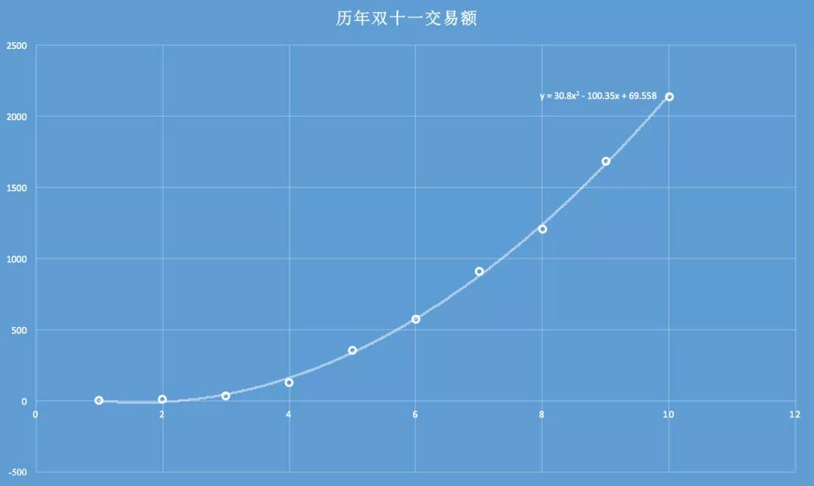
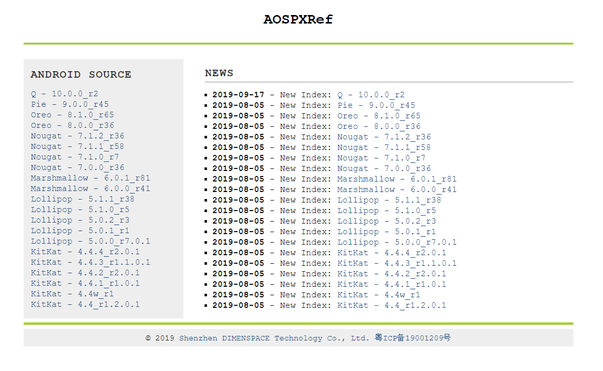
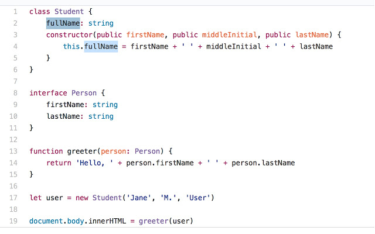
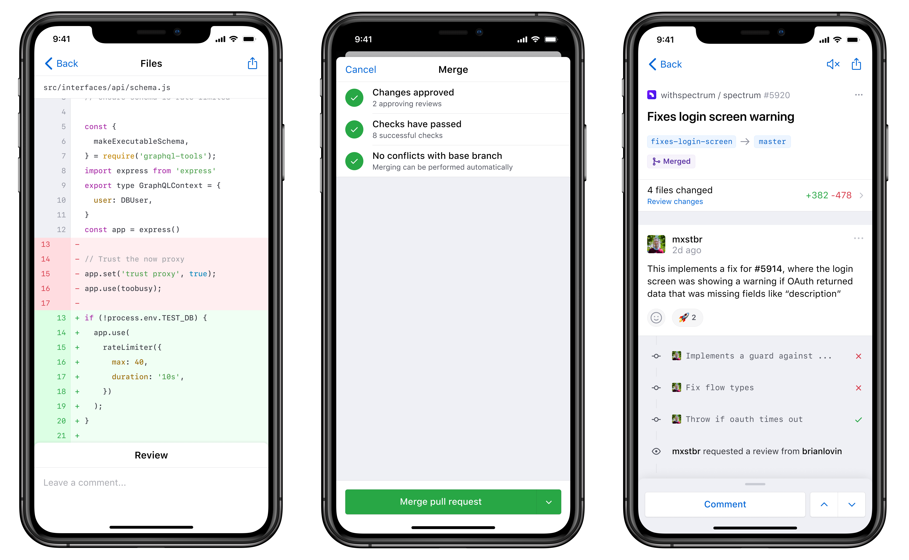
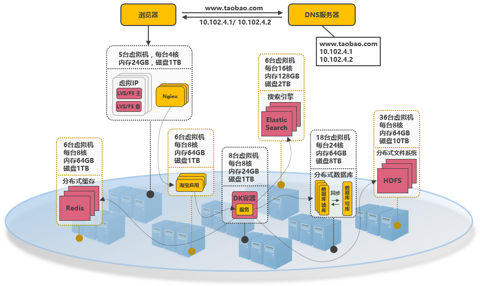

这里记录过去一周，我看到的值得分享的内容。

（题图：J. Berengar Sölter ）

## 文章

1、[我们在淘宝京东拼多多买东西时，有哪些价格歧视？](https://mp.weixin.qq.com/s/NjIUtuHg_T58ZsZZaPHZCA)

作者在京东工作，对平台和商家的一些商业套路比较了解。文章深入介绍了价格歧视的原理，商家使用的价格歧视策略。

2、[淘宝 1 小时交易额破千亿！](https://mp.weixin.qq.com/s/7IHIGAIrqtyQN4FjhuNjxQ)

作者在双 11 前使用天猫历年交易额，做了一个多项式的拟合，预测了今年双 11 的交易额是 2692 亿，最终的结果是 2684 亿 ，不得不说，非常神奇。

3、[想砍死北野武的女人们](https://mp.weixin.qq.com/s/iVqNKb6M1SfMD3FBOoGjDQ)

文章介绍了北野武戏剧性的一生，值得一看。

“ 我认为，一个人是不是长大成熟，由他对父母的感情方式来判定。当你面对父母，觉得他们很不容易时，就是迈向成熟的第一步。”

4、[做人，就做这样的人](https://mp.weixin.qq.com/s/xh1paOC54FwsPxxXVcc_HA)

人的一生，到底要怎么度过，如果你感到迷茫，充满焦虑，没有方向，可以看看这篇文章。

## 工具

1、[AOSPXRef](http://aospxref.com/)

Android 源码在线阅读网站，支持交叉引用跳转，服务器在国内，访问速度很快。

2、[octohint](https://github.com/pd4d10/octohint)

一款浏览器插件，在 GitHub 上浏览代码时能够快速定位变量出现或声明的位置。

3、[GitHub Mobile](https://github.com/mobile)

GitHub 发布首款官方手机客户端应用，目前只要 ios 的 App，安卓版本暂未发布。

## 资源

1、[服务端高并发分布式架构演进之路](https://segmentfault.com/a/1190000018626163)

文章以淘宝作为例子，介绍从一百个并发到千万级并发情况下服务端的架构的演进过程，同时列举出每个演进阶段会遇到的相关技术，让大家对架构的演进有一个整体的认知，文章最后汇总了一些架构设计的原则。

2、[命令行的艺术](https://github.com/jlevy/the-art-of-command-line)

熟练使用命令行是一种常常被忽视，或被认为难以掌握的技能，但实际上，它会提高你作为工程师的灵活性以及生产力。

3、[Flutter 实战](https://github.com/flutterchina/flutter-in-action)

由浅入深的介绍了 Flutter 技术和开发流程。

4、[正则表达式手册](https://tool.oschina.net/uploads/apidocs/jquery/regexp.html)

网站包含正则表达式全集和常见正则表达式。

5、[GeeksforGeeks](https://www.geeksforgeeks.org/)

这个网站包含了大量计算机相关的问题和解答，许多问题都有形象的图表和源代码。

6、[HOW HTTPS WORKS](https://howhttps.works/)

这个网站用图解的方式把 HTTP 相关的问题都说明得一清二楚，生动形象。如果你对 Http 不够熟悉，不妨看一下，肯定会很有收获的。

## 摘录

1、[司汤达在 1806 年致波丽娜的信中](http://m.xsshuku.com/files/article/html/17/17145/2517893.html)，给波丽娜的几点建议：

> 以下是我着力要培养的习惯。
>
> 1.锻炼身体。
>
> 2.调侃邪恶之人和无聊之人的才能。
>
> 3.选择一个工作，并从中培养习惯。为达到这点，必须悉心寻找自己的主要热情所在。
>
> 4.承受得住悲伤。
>
> 5.不要过分夸大自己无法体味的幸福。
>
> 6.当上前与一个人攀谈时要自问：“他需要什么？”而不是索要什么。
>
> 7.简洁的习惯。
>
> 研习对人体有益的食物，并养成食用的习惯。反复温习上述几条，仔细思考一下以下三条警句：
>
> 1.习惯于伤悲，每个人每天都会经历七八件伤悲的事。
>
> 2.不要过分夸大不属于自己的幸福。
>
> 3.学会顶住各种艰难的时刻，致力于完善我们的思想以及知晓事理的艺术。
>
> 关于以上三条警句的思索几乎囊括了幸福的含义。

2、北野武一些好玩的言论

> 1.他离婚之后接受采访，北野武说：
>
> 「今年真是没啥好事，我的钱都没了，没钱后朋友都联络不上了。曝光后情妇也没了。
> 早知道这么难，不如和前妻在一起。」
>
> 2.他还有个很出名的渣男语录，逻辑非常奇妙，是这样说的：
>
> 「尽管没多大意思，但情人还是越多越好的。
>
> 如果只有一个情人，就会形成一种三角关系，而三角关系就是一种有棱角的关系。如果有两个呢，就是四角关系。三个呢，五角关系……
>
> 照此类推，情人越多，关系就越接近于圆，棱角也就越少。这样的话，彼此间的摩擦和风波也会减少。」
>
> 3.北野武踏入电视圈之后，没想到路异常的顺利。他对此的感想是：
>
> 「幸好没才华的人这么多，让这件事没有想象中复杂。」
>
> 4.有一次，北野武的后辈又吉直树2015年时得了芥川奖，他很直接地说：
>
> 「这可把我气坏了。当时我就想，那样的东西我也能写出来，我一定要让人惊讶原来北野武也能写出这样的东西。」
>
> 后来呢，纯粹为了赌气，他竟然真的写了一本纯爱小说！[允悲]
>
> 5.在拔除从右脸横穿左脸的器械时，他在书里这样写：
>
> 我能感觉到金属棒在鼻子底下一点一点地挪出去，同时还发出嘎吱嘎吱的声音，那声音就像金属棒把我的脑汁也一并带了出来。
>
> 我说了句：「我现在完全理解了关东煮的心情。」
>
> 结果被医生怒斥：「别说蠢话！」
>
> 6.在某个他拍摄的广告发布会上，主持人热场：
> 「今天闪光灯真的多得让人睁不开眼啦。」
>
> 北野武：「嗯，特别像艺人外遇被曝光后的道歉记者发布会…….」
>
> 7.在欧洲，人们不知道他还是个喜剧演员，以为他是个很出名的黑帮分子。
> 有一次，他受英国电影协会邀请飞去伦敦，协会会长到机场接他，一路上诚惶诚恐。
>
> 「为您准备的豪华轿车突然发生故障，所以只好用这种车子来接您了，实在对不起。请您多包涵。」
>
> 他说自己几年之后才知道为什么会长是这种态度，他们成了好朋友之后会长告诉他：
>
> 「当时我心里真是吓得要死，怕你会为此杀了我。
> 因为我以为你是日本的黑帮头子。」