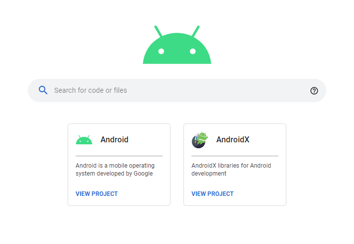

这里记录过去一周，我看到的值得分享的内容。

本周刊开源（GitHub: [zywudev/weekly](https://github.com/zywudev/weekly)），欢迎投稿，或者推荐好玩的东西。

(题图：[Payson Wick](https://unsplash.com/@paysonwick))

## 资源

1、[Python最佳实践指南](https://pythonguidecn.readthedocs.io/zh/latest/)

《Python 开发最佳实践指南》，中文版开源电子书，翻译自英语原版。 

2、[微软 REST API 设计指南](https://github.com/microsoft/api-guidelines/blob/master/Guidelines.md)

微软官方出品的 REST API 指导规范。

3、[Web 开发者 2020 年学习指南](https://github.com/andrews1022/web-development-2020-course-list)

GitHub 上有一位开发者根据 Udemy 的热门课程，整理了一份 Web 开发者 2020 年学习指南。其中包含常用的 Web 开发工具、设计软件、主流框架、基础知识、后端 & DevOps 技术堆栈等分类。

## 工具

1、[Code Search](https://cs.android.com/)

Android 官方最近为  AOSP 引入了代码搜索工具。

体验了下，挺好用的，可以在任意开源分支上切换，还支持交叉引用查找，感觉可以替代掉第三方的网站了。

2、[网红脸生成器](https://github.com/a312863063/seeprettyface-generator-wanghong)

一个网红脸生成器项目（非真实人脸）这是一个用 StyleGAN 训练出的网红脸生成器。

作者还开源了其他几个人脸生成器。

3、[Crater](https://github.com/bytefury/crater)

一款免费开源的 Web 与移动端发票应用：Crater。

可跟踪记录日常费用支出情况，并生成专业发票与消费报告。界面设计清新而简洁，适用于自由职业者或小型企业。

## 文摘

1、[《孩子王》阿城](http://www.readers365.com/baihuajiang/mydoc013.htm)

我的父亲是世界中力气最大的人。他在队里扛麻袋，别人都比不过他。我的父亲又是世界中吃饭最多的人。家里的饭，都是母亲让他吃饱。这很对，因为父亲要做工，每月拿钱来养活一家人。但是父亲说：“我没有王福力气大。因为王福在识字。”父亲是一个不能讲话的人，但我懂他的意思。队上有人欺负他，我明白。所以我要好好学文化，替他说话。父亲很辛苦，今天他病了，后来慢慢爬起来，还要去干活，不愿失去一天的钱。我要上学，现在还替不了他。早上出的白太阳，父亲在山上走，走进白太阳里去。我想，父亲有力气啦。

## 言论

1、

最后十年

在我 20 来岁的时候，我觉得青春只剩最后十年了 

在我 30 来岁的时候，我觉得职场只剩最后十年了 

在我 40 来岁的时候，我觉得人生只剩最后十年了 

在我 50 来岁的时候，我觉得精力只剩最后十年了 

在我 60 来岁的时候，我觉得生命只剩最后十年了 

是的，我们人生只有最后十年…… 

—— hao chen

2、

我们的人生是由命运和因果报应两条法则互相交织而成的。这两者互相干涉，比如当命运非常恶劣时，做一点好事，并不会出现好的结果，因为仅有的一点善行为强势的厄运所淹没。同样，当好运非常旺盛时，稍稍做点坏事，也不会马上出现恶因招恶果的情形。 

-- 稻盛和夫

3、

任何傻瓜都能写计算机能理解的代码，优秀的程序员编写人类能够理解的代码

-- Martin Fowler