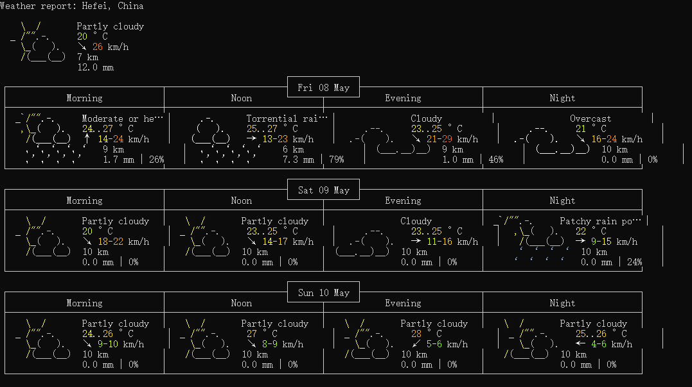
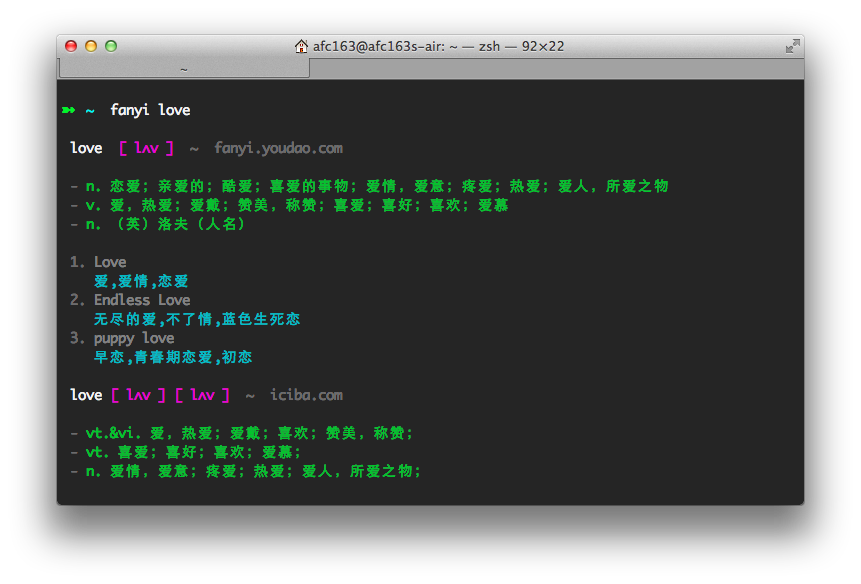
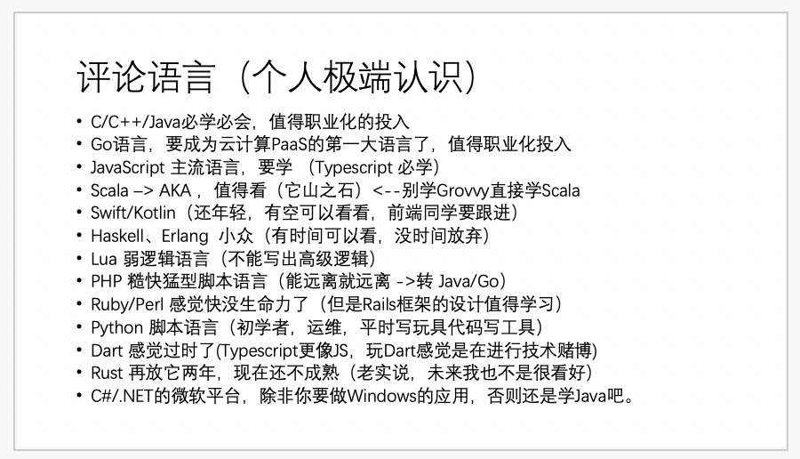
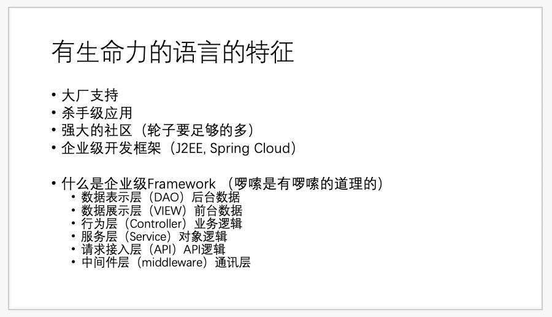

---

title: 每周分享第 7 期
date: 2020-05-08 10:30:26
tags: 每周分享
categories: 每周分享
---

这里记录过去一周，我看到的值得分享的内容。

本周刊开源（GitHub: [zywudev/weekly](https://github.com/zywudev/weekly)），欢迎投稿，或者推荐好玩的东西。

## 文章

1、[这一年团队的磨合与成长](https://mp.weixin.qq.com/s/c_NOv87v6J9reByD6EQbrw)

作者讲述了自己在字节跳动组建团队过程中的一些故事和感悟。

“如果你喜欢一只蝴蝶，千万不要去追，因为你追不上她。你应该去种花、种草，等到春暖花开的时候，等到草长莺飞的时候，蝴蝶自然会飞回来。如果你喜欢的那只蝴蝶没有飞回来，怎么办呢? 你有了花，有了草，有了阳光，有了雨露，有了独特的魅力，那只蝴蝶没有飞回来，其他的蝴蝶会飞回来，比她更好的会飞回来，这就叫做花开蝶自来，爱情如此，生活如此，事业也如此。”

2、[那些消失的安卓技术博主们](https://juejin.im/post/5e93e305f265da48076dfce3)

任何技术都有消失的时候，相聚离开总有时候，没有什么会永垂不朽。唯有经验与思维永存。

3、[终端Terminal:程序员是如何查询天气预报的?](https://xie.infoq.cn/article/9d3aa424d319535f867c90dea)

作者介绍了如何用终端命令查询天气，很酷。

## 资源

1、 [leetcode 前 300 题详细通俗的题解](https://leetcode.wang/)

前 300 题每道都进行了详细通俗的分析，并且提供多种思路解法。

2、[Pragmatic Programmer中译](https://caicaishmily.gitbooks.io/pragmatic_programmer/)

译者历时两个月将 《Pragmatic Programmer》翻译成中文。

## 工具

1、[Fanyi](https://www.npmjs.com/package/fy)

命令行词典，无需打开词典应用。

2、[DeepL](https://www.deepl.com/home)

一款来自德国的“高质量”人工智能多国语言翻译工具 ，支持中文、英语、德语、法语、日语、西班牙语、意大利语、荷兰语及波兰语之间的全文翻译。

3、[Draw.io](https://draw.io)

在线图表绘制应用，界面异常简洁高效。

流程图、结构图、网络拓扑图等各种类型的图表都能用它来画。

## 图片

1、台上是生活，台下是希望

 

2、陈皓发的[推文](https://twitter.com/haoel/status/1254974994964086785)，从程序员职业发展的角度评论编程语言，有生命力、有市场需求的语言值得投入。

