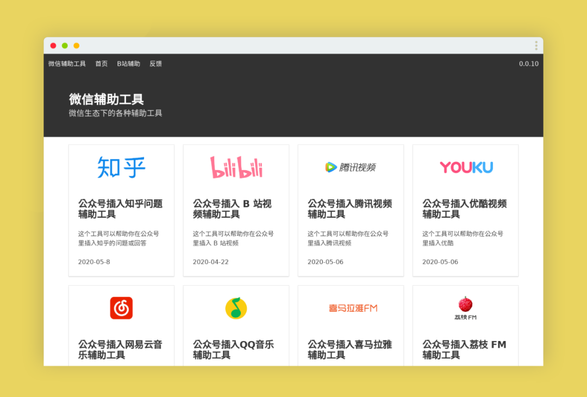
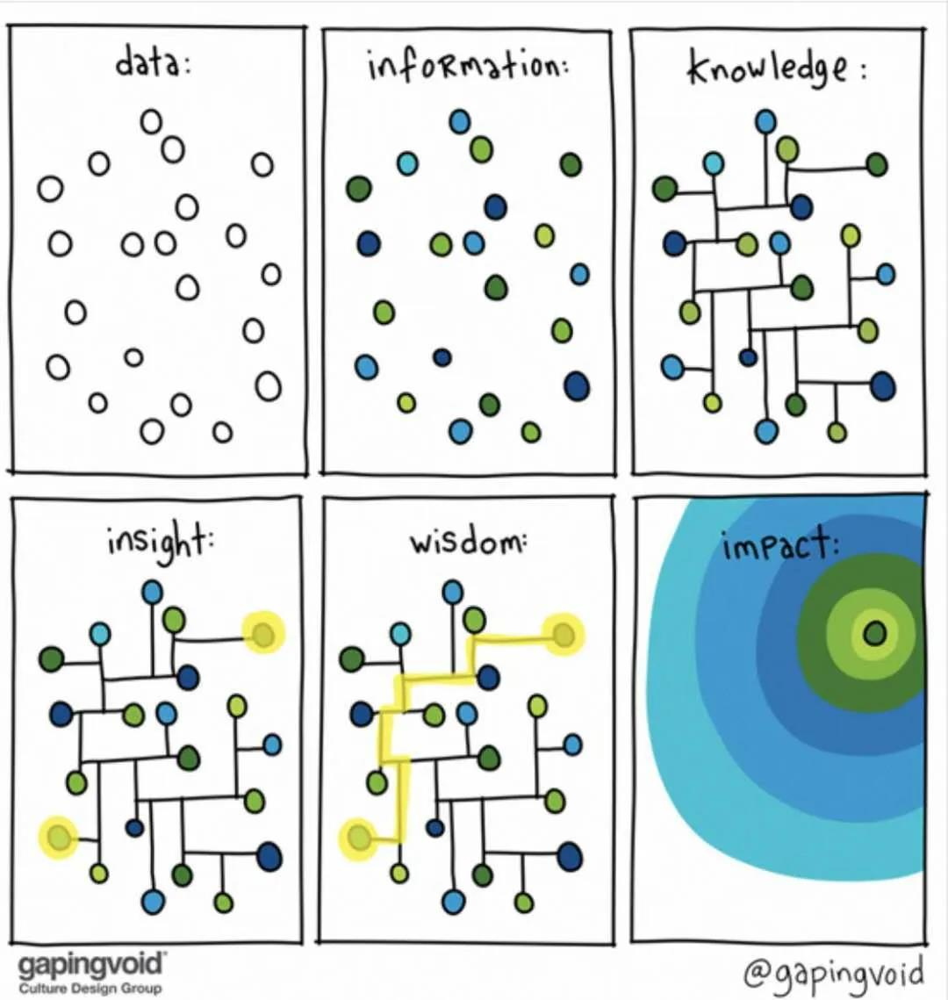

这里记录过去一周，我看到的值得分享的内容。

本周刊开源（GitHub: [weekly](https://github.com/zywudev/weekly)），欢迎投稿，分享文章、资源、工具等。

## 文章

1、[想退休，可能没机会了](https://xie.infoq.cn/article/2f6a0bf7ba908d75219be726c)

别再想着三十五岁或四十五岁退休了。好好工作，好好生活，不辜负这样的时代。

2、[您可坐稳了，海苔...其实是紫菜做出来的!](https://mp.weixin.qq.com/s/E7NQW5OU15kwkUWUW0fAyw)

涨知识，有意思的公众号，推荐订阅。

## 资源

1、[Learn Git Branching](https://learngitbranching.js.org/)

一个 Git 命令可视化学习项目。能够生动形象的帮助开发人员理解、学习 Git 命令，通过一系列刺激的关卡挑战，逐步深入的学习 Git 的强大功能。

2、[fucking-algorithm](https://github.com/labuladong/fucking-algorithm)

解 LeetCode 题目集合。号称“手撕 LeetCode 题目”，该项目旨在传递算法思维。

## 工具

1、[WXMarkdown](http://www.wxmarkdown.com/)

微信辅助工具，一个帮助你在微信公众号文章中插入不同社区、平台的小工具。

2、[AR Copy Paste](https://arcopypaste.app/)

可以将周围环境的元素剪下，然后粘贴到 Photoshop 中。

3、[泥石流海报](https://graph.readhub.cn/)

根据网址快速创建一张带二维码的海报图。

## 图片

1、

## 言论

1、

一旦你意识到精力有限，以下这些事情你就再也不会做了：为消费排队、拐弯抹角说话、单恋倒贴死缠难打、分析人际关系和对己看法、在网上跟陌生人吵架……年轻人才有资格挥霍精力，你是成年人了，你的精力要用来挣钱。

---- 反裤衩阵地